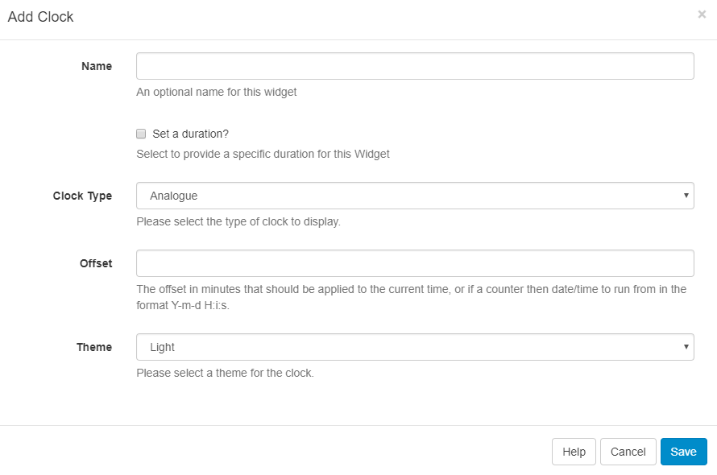
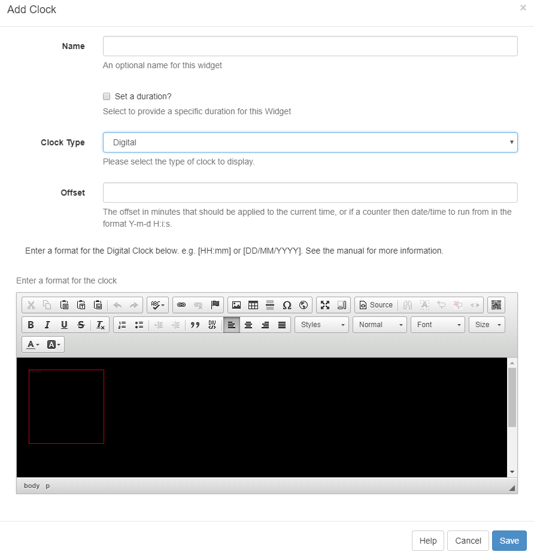
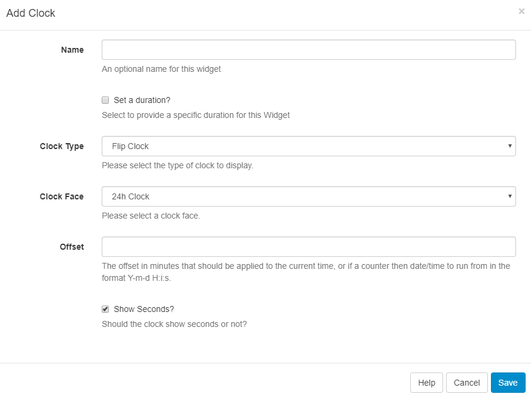

<!--toc=media-->
#Clock
The clock module is used to show an analogue, digital or flip clock set to the current time or the current time +/- an offset.

##Analogue
The analogue clock is a traditional clock face available in a light or dark theme (black or white face).

##Digital
The digital clock has a text editor to provide a template for the clock. The font, size, colour and other properties of the template can be changed as normal.

The formatting is a `JavaScript` based format and must be entirely represented between two square brackets.

##Flip Clock
The flip clock is a pre-formatted clock that animates a "flip" for each second, minute and hour elapsed.

