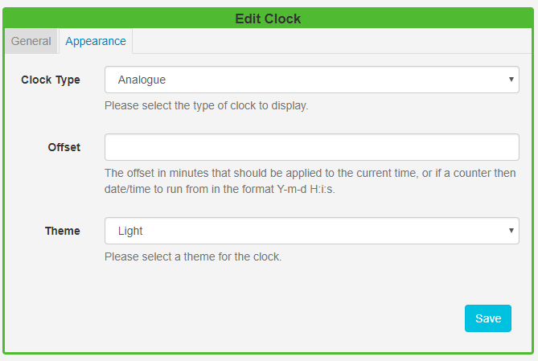
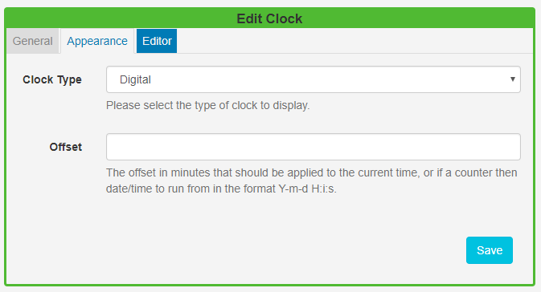
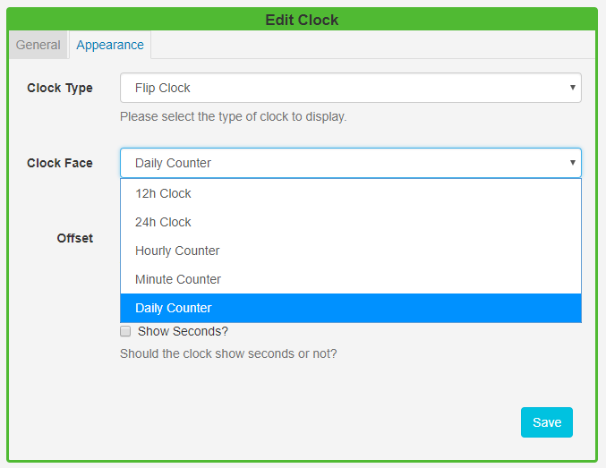

<!--toc=widgets-->

# Clock

The Clock Widget can be used to show an **Analogue**, **Flip** or **Digital Clock** as well as a **Countdown** on Layouts.

Click on the **Clock Widget** on the toolbar,  add / drag to the target **Region**.  

{tip}
If you are using 1.8 select **Clock** from the Widget Toolbox to add to your Region Timeline.
{/tip}

### General

- Provide an optional name
- Choose to override the default duration

### Appearance

Use the drop-down menu to select the type of clock to display:

#### Analogue

The Analogue Clock is a traditional clock face available in a Light or Dark theme (black or white face).

#### Digital

The Digital Clock has an additional Editor tab so that a template can be entered for the Digital Clock. 

The font, size, colour and other properties of the template can be changed.  Toggle on the **Visual editor** to access the inline editor and click on the edit icon in the Preview window.

Enter text and formatting, use the **Snippets** menu to include available merge fields. See the section **Formatting the time** for further information.

{tip}
If you are using 1.8 use the text editor at the bottom of the form to enter a format for the clock.
{/tip}

#### Flip Clock

The Flip Clock is a pre-formatted clock that animates a "flip" for each hour, minute and seconds (optional) elapsed.

The **Flip Clock** also has Hourly, Minute and Daily **Counter** options which run from a specified date/time to give a Countdown on Layouts.

## Formatting the Time

The time can be formatted by providing "tokens" that sit between square brackets [] in the template area.

| Title                      | Token   | Output                                 |
| -------------------------- | ------- | -------------------------------------- |
| Month                      | M       | 1 2 ... 11 12                          |
|                            | Mo      | 1st 2nd ... 11th 12th                  |
|                            | MM      | 01 02 ... 11 12                        |
|                            | MMM     | Jan Feb ... Nov Dec                    |
|                            | MMMM    | January February ... November December |
| Quarter                    | Q       | 1 2 3 4                                |
| Day of Month               | D       | 1 2 ... 30 31                          |
|                            | Do      | 1st 2nd ... 30th 31st                  |
|                            | DD      | 01 02 ... 30 31                        |
| Day of Year                | DDD     | 1 2 ... 364 365                        |
|                            | DDDo    | 1st 2nd ... 364th 365th                |
|                            | DDDD    | 001 002 ... 364 365                    |
| Day of Week                | d       | 0 1 ... 5 6                            |
|                            | do      | 0th 1st ... 5th 6th                    |
|                            | dd      | Su Mo ... Fr Sa                        |
|                            | ddd     | Sun Mon ... Fri Sat                    |
|                            | dddd    | Sunday Monday ... Friday Saturday      |
| Day of Week (Locale)       | e       | 0 1 ... 5 6                            |
| Day of Week (ISO)          | E       | 1 2 ... 6 7                            |
| Week of Year               | w       | 1 2 ... 52 53                          |
|                            | wo      | 1st 2nd ... 52nd 53rd                  |
|                            | ww      | 01 02 ... 52 53                        |
| Week of Year (ISO)         | W       | 1 2 ... 52 53                          |
|                            | Wo      | 1st 2nd ... 52nd 53rd                  |
|                            | WW      | 01 02 ... 52 53                        |
| Year                       | YY      | 70 71 ... 29 30                        |
|                            | YYYY    | 1970 1971 ... 2029 2030                |
| Week Year                  | gg      | 70 71 ... 29 30                        |
|                            | gggg    | 1970 1971 ... 2029 2030                |
| Week Year (ISO)            | GG      | 70 71 ... 29 30                        |
|                            | GGGG    | 1970 1971 ... 2029 2030                |
| AM/PM                      | A       | AM PM                                  |
|                            | a       | am pm                                  |
| Hour                       | H       | 0 1 ... 22 23                          |
|                            | HH      | 00 01 ... 22 23                        |
|                            | h       | 1 2 ... 11 12                          |
|                            | hh      | 01 02 ... 11 12                        |
| Minute                     | m       | 0 1 ... 58 59                          |
|                            | mm      | 00 01 ... 58 59                        |
| Second                     | s       | 0 1 ... 58 59                          |
|                            | ss      | 00 01 ... 58 59                        |
| Fractional Second          | S       | 0 1 ... 8 9                            |
|                            | SS      | 0 1 ... 98 99                          |
|                            | SSS     | 0 1 ... 998 999                        |
| Timezone                   | z or zz | EST CST ... MST PST                    |
|                            | Z       | -07:00 -06:00 ... +06:00 +07:00        |
|                            | ZZ      | -0700 -0600 ... +0600 +0700            |
| Unix Timestamp             | X       | 1360013296                             |
| Unix Millisecond Timestamp | x       | 1360013296123                          |