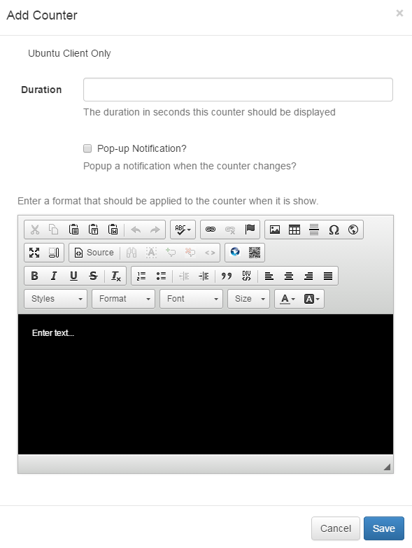

<!--toc=widgets-->
# Counter
The counter module provides an on screen counter which counts up or down in response to key presses (or to key presses generated by a wireless presenter style remote control - often used to control PowerPoint presentations).

It was originally written to cater for paper ticket systems where customers entering a business premises take a number from a dispenser and wait for their number to be called before obtaining a product or service.

The Counter module is only supported by the Ubuntu Display Client

In its most basic form, there is no need to add a Counter media type at all. From v1.3.0 of the Ubuntu client, you can simply press Page Up or Page Down keys on the client machine (or via a wireless presenter style remote) and a pop-up overlay will appear displaying the current counter number.

This pop-up overlay can be styled and configured using the configuration variables in the client `site.cfg` file as follows:

*   nextScanCode=112 - Keyboard scan code used to increment the counter
*   resetScanCode=0 - Keyboard scan code used to zero the counter
*   prevScanCode=117 - Keyboard scan code used to decrement the counter
*   maxCount=99 - Number the counter should count up to or down from
*   osdBackColour=000000 - HTML/Hex colour for the pop-up background
*   osdBackOpacity=0.7 - How opaque the background of the pop-up should be
*   osdFontSize=270 - Font size of the number displayed in the pop-up
*   osdFontColour=ffffff - Font colour of the number displayed in the pop-up in HTML/Hex
*   osdWidthPercent=40 - Percentage of the width of the screen that the pop-up should occupy
*   osdTimeOut=5000 - How many milliseconds the pop-up should be displayed for

If you are not sure what scan codes there are, you can press "i" then "l" with the client running. That will pop-up the on-screen logging. Any key press that is not currently being used will generate a log message with the scan code for that key - so you can get the code you need and another the client configuration.

## The Counter Form

- **Duration**

    The duration in seconds that this item should remain in the Region.

- **Pop-up Notification?**

    Enables or disables the pop-up overlay. Leaving the box un-ticked will disable the pop-up while this media item is being shown on screen.

- **Template**

    Editor for defining the template that should be used when displaying this Counter. The [Counter] tag should be used to indicate where the current Counter value should appear.
