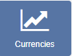
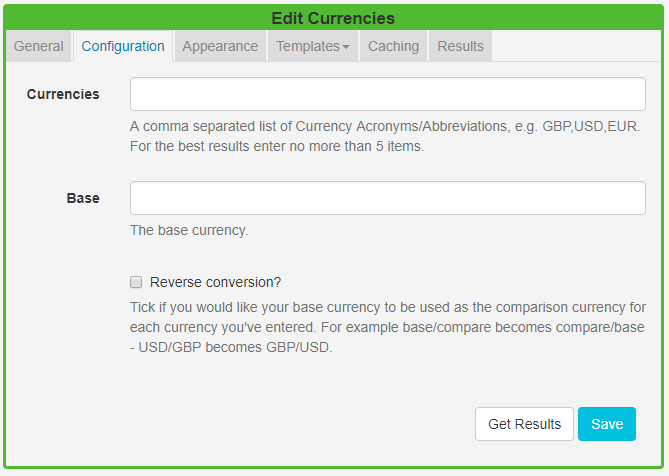
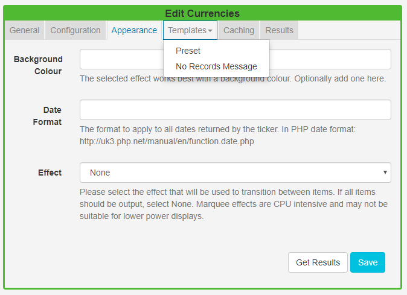
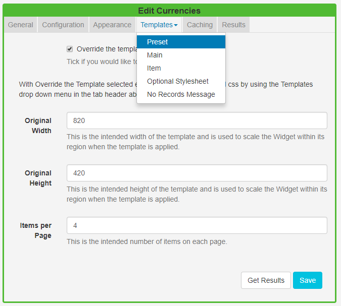

<!--toc=widgets-->

# Currencies

The Currencies Widget provides exchange rates for many currency pairs when added to a Layout.

{nonwhite}
{cloud}
The Currencies Module is configured for **Xibo in the Cloud** customers with an API key provided as part of the service. Skip the Installation steps detailed below and follow the set up from the **Add Currencies Widget** section.
{/cloud}

**Non-Xibo in the Cloud customers please follow the Installation steps as detailed below.**

{/nonwhite}

## Installation
The Currencies Widget relies in part on the [Alpha Vantage API](https://www.alphavantage.co/) to retrieve exchange rates. 
Prior to installation you will need an API key. 

Please visit [Alpha Vantage](https://www.alphavantage.co/support/#api-key) to create an account and obtain a key.

The Currencies Module is installed from the Modules page, under the Administration section of the Menu. Click on the **Install Module** button and select the Module to install.

After installation,  select the Currencies Module from the grid and use the row menu to select **Edit**.

Complete the form fields and include the **API key** and Cache Period settings.

## Add Currencies Widget

Click on the **Currencies Widget** on the toolbar,  add / drag to the target **Region**.  

{tip}
If you are using 1.8, select **Currencies** from the Widget Toolbox to add to your Region Timeline and complete the form fields as explained below.
**Please note:** The Visual editor is not available in the 1.8 series CMS for this Widget.
{/tip}

### General

- Provide an optional name
- Choose to override the default duration
- Select whether the duration is per item, unticked the duration will be per page / number of items.

### Configuration

- Define currencies using their **acronym/abbreviation** (symbols or written text will not be recognised).
- Include a **Base** currency.
- Select **Reverse conversion** if you would like to use your base currency as the comparison.

### Appearance

- Optionally choose a **background colour** 
- Include a PHP **Date Format** to apply to returned results, see the bottom of the page for further information.
- Select an optional **Effect** and **Speed** to be used to transition between items.

### Templates

**Preset** - Use the drop-down to select an appropriate Template.

**Override the template** - Tick in the box to edit the selected template. Please see the section below for further information.

{tip}
Provide a **No Records Message** to display when there are no records returned.
{/tip}

### Caching

Include a suitable time for the Update Interval in minutes, keeping it as high as possible.

### Overriding Templates

Templates can be edited by selecting a Template using the drop-down and clicking in the **Override the template** checkbox. 

Click again on the **Templates** tab and select to edit:

#### Main Template

Toggle **On** the Visual editor to access the inline editor to enter text and formatting.

{tip}
Get Results at anytime to see what data is returned. Any field is available as a substitute to use in the template by simply entering the field name between square brackets [].
{/tip}

#### Item Template

Enter a Template to be applied to each item, use the Visual editor (as above).

## Date Format - PHP

[[PRODUCTNAME]] should accept any date format that is in a correct PHP date format, the following characters are recognised and can be used:

| Format Character | Description                                                  | Example returned values                 |
| ---------------- | :----------------------------------------------------------- | --------------------------------------- |
|                  | **Day**                                                      |                                         |
| d                | Day of the month, 2 digits with leading zeros                | 01 to 31                                |
| D                | A textual representation of a day, three  letters            | Mon through Sun                         |
| j                | Day of the month without leading zeros                       | 1 to 31                                 |
| l                | (lowercase ‘L’) A full textual representation of the day of the week | Sunday through Saturday                 |
| N                | ISO-8601 numeric representation of the day of the week (added in PHP 5.1.0) | 1 (for Monday) through 7 (for Sunday)   |
| S                | English ordinal suffix for the day of the month, 2 characters | st, nd, rd or th. Works well with j     |
| w                | Numeric representation of the day of the week                | 0 (for Sunday) through 6 (for Saturday) |
| z                | The day of the year (starting from 0)                        | 0 through 365                           |
|                  | **Week**                                                     |                                         |
| W                | ISO-8601 week number of year, weeks starting on Monday (added in PHP 4.1.0) | 42 (the 42nd week in the year)          |
|                  | **Month**                                                    |                                         |
| F                | A full textual representation of a month, such as January or March | January through December                |
| m                | Numeric representation of a month, with leading zeros        | 01 through 12                           |
| M                | A short textual representation of a month, three letters     | Jan through Dec                         |
| n                | Numeric representation of a month, without leading zeros     | 1 through 12                            |
| t                | Number of days in the given month                            | 28 through 31                           |
|                  | **Year**                                                     |                                         |
| L                | Whether it’s a leap year                                     | 1 if it is a leap year, 0 otherwise.    |
| o                | ISO-8601 year number. This has the same value as Y, except that if the ISO     week number (W) belongs to the previous or next year, that year is used instead. (added in  PHP 5.1.0) | 1999 or 2003                            |
| Y                | A full numeric representation of a year, 4 digits            | 1999 or 2003                            |
| y                | A two digit representation of a year                         | 99 or 0                                 |