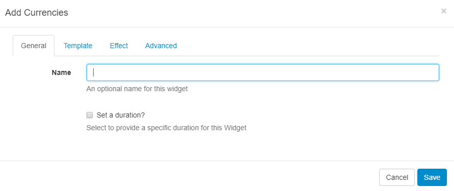
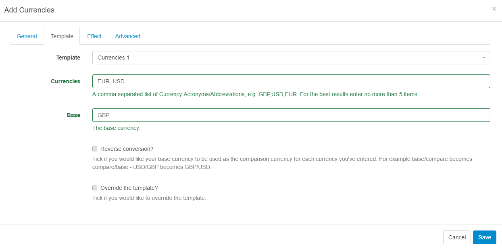

<!--toc=widgets-->
# Currencies

The Currencies Widget provides exchange rates for many currency pairs when added to a Layout.

{nonwhite}
{cloud}
The Currencies Module is configured for **Xibo in the Cloud** customers with an API key provided as part of the service. Skip the Installation steps detailed below and follow the set up from the **Currencies Widget** section.
{/cloud}

**Non-Xibo in the Cloud customers please follow the Installation steps as detailed below.**

{/nonwhite}

## Installation

Prior to installation you will need an API key. Please visit [Alpha Vantage](https://www.alphavantage.co/support/#api-key) to create an account and obtain a key.

The Currencies Module is installed from the Modules page, under the Administration section of the Menu. Click on the **Install Module** button and select the Module to install.

After installation,  select the Currencies Module from the grid and use the row menu to select **Edit**.

Complete the form fields and include the **API key** and Cache Period settings.

## Currencies Widget

Select the Currencies Widget from the Widget Toolbox to add to your Region Timeline.  Complete the form fields:

#### **General**

Give an optional name and select to override the default duration if required.

#### **Template**

- Use the drop-down menu to select a **Template**
- Define currencies using their **acronym/abbreviation** (symbols or written text will not be recognised)
- Include a **Base** currency.

#### **Effect**

Select an optional Effect and Speed

#### **Advanced**

Optionally choose a Background Colour and include a message to be displayed when no records are returned. 

