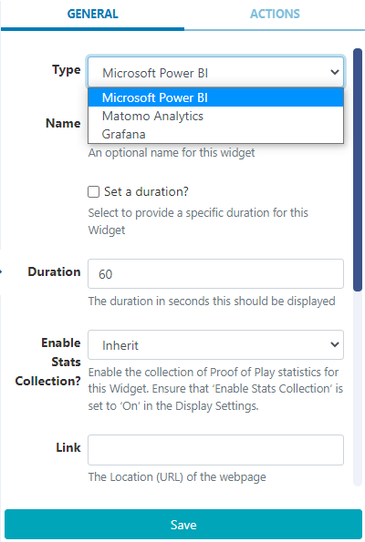
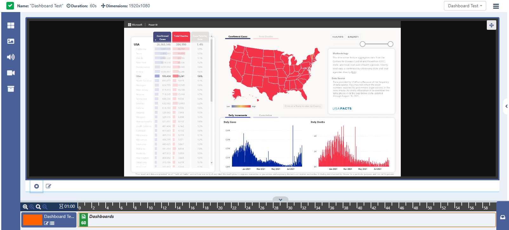
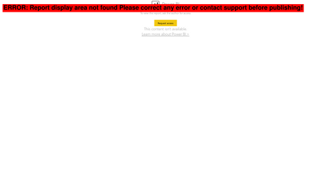

<!--toc=widgets-->

# Dashboards

{white}
**Please note:** If you would like to take advantage of this Widget, please contact your Administrator.
{/white}

{nonwhite}
The Dashboards Widget is used to display [Dashboards](/manual/en/media_dashboard_service.html) that have been configured to use the [Xibo Dashboards Service](/docs/setup/xibo-dashboard-service)

**Please note:** This commercial Widget is part of the **Xibo Dashboard Service** available from v3.2.0 and requires an API for configuration as further explained [here](/pricing#dashboards)

{feat}Dashboards Widget|v3{/feat}

## Add Widget

Locate **Dashboards** from the [Widget](layouts_widgets.html)  toolbar and click to **Add** or **Grab** to drag and drop to a Region.

On adding, configuration options are shown in the right hand properties panel:

- Use the drop down to select the dashboard service **Type** to use from the ones that have been configured in the connector.
- Provide a **Name** for easier identification.
- Choose to override the default **Duration** if required.
- In the **Link** field, enter the URL to embed from your chosen dashboard. 

{tip}
Please see the following page for further information on obtaining a URL to use with this service, authentication mechanisms and possible limitations [Xibo Dashboard Service](/docs/setup/xibo-dashboards-service)
{/tip}

- **Save** changes

{tip}
**Please note:** On first entering a URL into the Dashboard Widget it may take a few moments to load as it is dependent on how long it takes to render your dashboard content, and how busy the service currently is.

Once you are showing your dashboards on displays, the service will keep your dashboards updated at the interval you specify so it will always be ready to show and appear instantly on Displays.

If you stop showing a dashboard on your displays for a time, then the service will stop refreshing it, but will start again automatically the next time that dashboard is shown.
{/tip}

**Please note:** If Xibo detects an error with a request for dashboard services, you will see a red banner message over the top of a screengrab to give an indication to the user where the problem has occurred. This will be shown in the Layout Designer previewer only for the logged in user. The Layout Preview and Displays showing the scheduled Layout will continue to show the last good capture or a spinner icon until the issue has been resolved.

Example Error message with screengrab shown below:

## Actions

Interactive Actions can be attached to this Dashboard Widget from the **Actions** tab in the properties panel. Please see the [Interactive Actions](layouts_interactive_actions.html) page for more information.
{/nonwhite}

