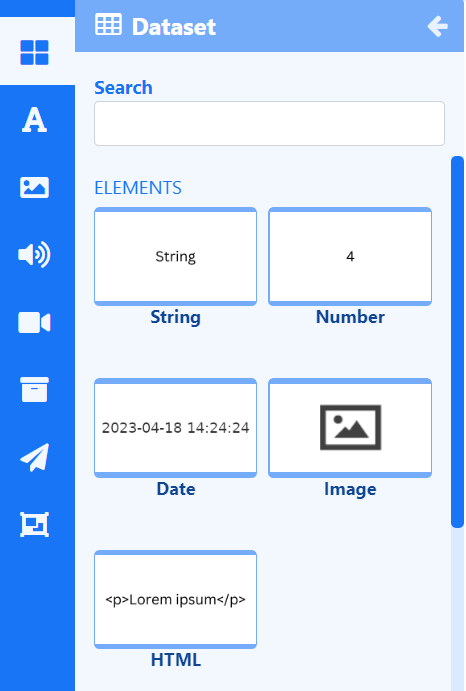
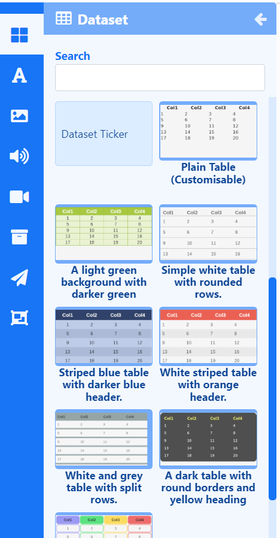

# DataSet

Display data held in a DataSet anywhere on a Layout using **Elements** or include **Static Templates** to show Tickers and Tables of data in Layouts/Playlists.

{feat}DataSets|v4{/feat}

The DataSet Widget primarily consists of a DataSet source which feeds into configured Elements and Static Templates.

{tip}
[DataSets](media_datasets.html) need to be created and defined prior to adding the DataSet Widget to Layouts/Playlists. 
{/tip}

## DataSet Elements

[Elements](layouts_editor#content-data-widgets-and-elements) are available for selection when adding a DataSet Widget to a [Layout](layouts_editor.html) to give Users more control over what components of the DataSet Widget to use and where they can be placed. 

{tip}
You will see a message in the properties panel should you try to use an Element that has no matching field type in your DataSet!
{/tip}

Each Element has a set of configuration options in the Properties Panel. A DataSet must be selected to use as the data source from the **Configure** tab for each Element used on the Layout. Control how items should be cycled by specifying a [Data Slot](layouts_editor.html#content-data-slots) to use for each of the added Elements. Data Elements can be further complimented by adding [Global Elements](layouts_editor.html#content-global-elements) to add shapes and text which can all be put into an [Element Group](layouts_editor.html#content-grouping-elements) for easier configuration and positioning.

## DataSet Static Templates

[Static Templates](layouts_editor.html#content-static-templates) define how returned data should be laid out and styled and are a simple way to show your data using pre-styled templates.

Templates can be configured to affect the behaviour of returned results as well as make changes to the design appearance using a range of options in the Properties Panel. A DataSet must be selected to use as the data source from the **Configure** tab for each Template added to the Layout/Playlist.

## Overview

- Update Elements and Templates with new data by editing the underlying [DataSet](media_datasets.html#content-adding-data-to-columns) data.
- Update DataSet Widget content without accessing Layouts or Playlists.
- Order and Filter results by any column.

- Shuffle items to play in a random sequence.
- Content for this media is cached by the Players for off-line playback.
- Set a 'freshness check' to determine when to switch to the 'No data' message when a Player is offline.

