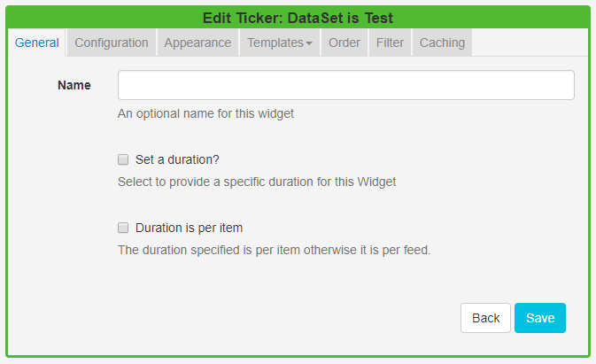
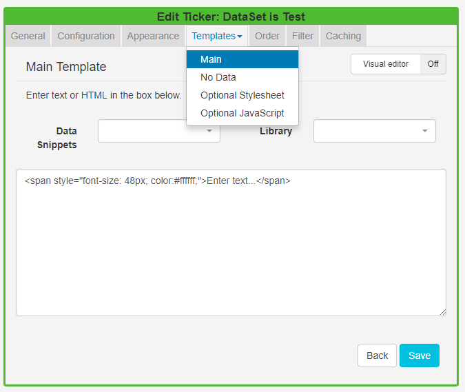
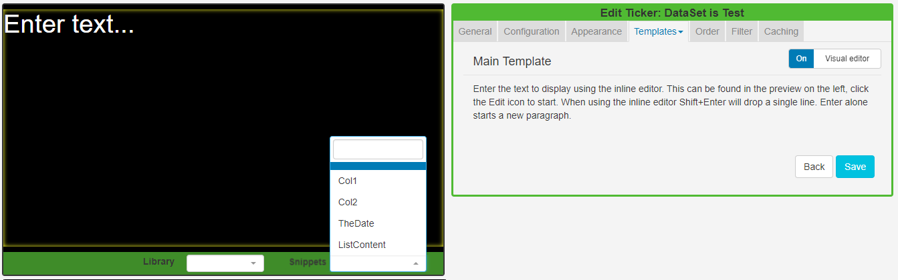

<!--toc=widgets-->
# DataSet Ticker

The DataSet Ticker Widget allows for **DataSet** content to be displayed as a **Ticker** on a Layout. The Ticker module primarily consists of a data source location and a template to apply to the retrieved data.
{tip}
Ensure that a [DataSet](https://xibo.org.uk/manual/en/media_datasets.html) has been created and configured prior to using this Widget.
{/tip}

{tip}
If you are using 1.8, DataSets can be displayed using Tickers. Please use the following link :[Ticker 1.8](media_module_ticker_1.8.html)
{/tip}

## Add DataSet Ticker

Click on the **DataSet Ticker Widget** on the toolbar,  add / drag to the target **Region**.  

- Use the drop-down menu to select the **DataSet** to be used as the source of data for the Ticker.
- Save

{tip}
You cannot change to a different DataSet once it has been added to a DataSet Ticker. To use an alternative DataSet a **new** DataSet Ticker would need to be created.
{/tip}

Once saved the **Edit Ticker** form will open to provide further options.

### General

- Provide an optional name
- Choose to override the default duration
- With Duration is per item selected, the configured duration will be extended by the number of items returned by the Data Source.

{tip}
This should be used with caution as it can create long-running media items. It is recommended to use this setting in conjunction with a setting to limit the number of items shown.
{/tip}

### Configuration

Select if returned items should be shown side by side and configure **Upper** and **Lower** row limits.

### Appearance

- Optionally select a background colour
- Use the drop-down menu to select an **Effect** to be used to transition between items.
- Set the **Speed** for the effect selected.
- Enter how many Items should appear on each page if an effect to split items has been selected.

### Templates

Click on the Template header to format the Main Template.

Toggle **On** the Visual editor to use the inline editor. Click in the preview window to open. 

The available columns to use in the template can be found in the **Snippets** menu.

{tip}
Use the **No Data Template** to include a message to ensure that your audience is not left with blank displays when there is no data to display.
{/tip}

{tip}
The Optional Style Sheet is intended for advanced users to 'tweak' the CMS generated output.
{/tip}

### Order

Order the DataSet results by using the clause builder or by using an advanced filter clause using SQL syntax, e.g. Name DESC

### Filter

Filter the DataSet to exclude/include results by using the clause builder or by using an advanced filter cause using the SQL syntax.

### Caching

Players can **cache** the content of this media type to prevent repeated downloads and off-line playback. Keep this number as high as possible.

