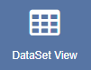
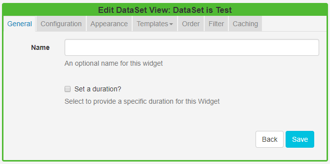

<!--toc=widgets-->

# DataSet View

The DataSet View Widget allows content from a created DataSet to be added into a **Region**, organised and displayed in a tabular format.

When the underlying **DataSet Data** is changed, the DataSet View Widget included in your Layout(s), will automatically update with the new data.
{tip}
Once a DataSet has been added to a DataSet View, care should be taken when editing the column structure of the DataSet.
{/tip}

Ensure that you have created a [DataSet](media_datasets.html) prior to adding a DataSet View to a Layout.

## Add DataSet View

Click on the **DataSet View Widget** on the toolbar,  add / drag to the target **Region**.  


- Use the drop-down menu to select the **DataSet** to be used as the source of data for the DataSet View.
- Save

{tip}
If you are using 1.8, select **DataSet View** from the Widget Toolbox to add to your Region Timeline and complete the form fields as explained below. 
{/tip}

{tip}
You cannot change to a different DataSet once it has been added to a DataSet View. To use an alternative DataSet a **new** DataSet View would need to be created.
{/tip}

Once saved the **Edit DataSet View** form will open to provide further options.



### General

- Provide an optional name
- Choose to override the default duration.

### Configuration

- Click or drag and drop to select available columns.
- Choose to show the table headings
- Configure **Upper** and **Lower** row limits
- Split the data over multiple pages using **Rows per Page**.

### Appearance

- Select a Template using the drop-down menu
- Choose to override the Template

{tip}
By selecting to **Override the Template** you can use a **CSS style sheet** to control the visual styling of the table. (Example style sheet at the bottom of this page).
{/tip}

Complete the form fields to style your DataSet View by selecting colouring and fonts/font size to use.

### Templates

Select the **No Data Template** to provide a message to display when there is no data to show.

{tip}
Toggle on the Visual editor to use the inline text editor.
{/tip}

### Order

Order by any column using the clause builder or by providing a SQL command for more complex ordering.

### Filter

Filter by any Column using the clause builder to only include/omit results based on chosen criteria. Provide a SQL command for more complex filtering.

### Caching

Enter an update interval in minutes, kept as high as possible. (Displays can cache the content of this media type to prevent repeated download of identical resources, as well as for off-line playback).

## Example Style Sheet

```css
table.DataSetTable {
font-family:"Trebuchet MS", Arial, Helvetica, sans-serif;  
width:100%;
border-collapse:collapse;
}

tr.HeaderRow {
font-size:1.1em;
text-align:center;
padding-top:5px;
padding-bottom:4px;
background-color:#A7C942;
color:#ffffff;
}

tr#row_1 {
color:#000000;
background-color:#EAF2D3;
}

td#col_1 {
color:#000000;
background-color:#EAF2D3;
}

td.DataSetColumn {
color:#000000;
background-color:#EAF2D3;
border:1px solid #98bf21
}

tr.DataSetRow {
text-align:center;
color:#000000;
background-color:#EAF2D3;
border:1px solid #98bf21
padding-top:5px;
padding-bottom:4px;
}

th.DataSetColumnHeaderCell {
font-size:1em;
border:1px solid #98bf21;
padding:3px 7px 2px 7px;
}

span#1_1 {

}

span.DataSetColumnSpan {

}
```