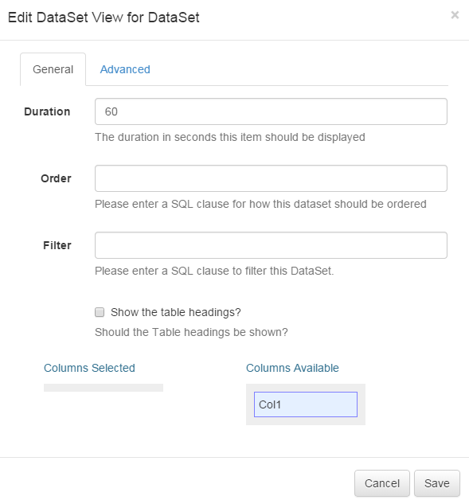

<!--toc=widgets-->
# DataSet Views

The DataSet View module allows content from a DataSet to be added into a Region, organised and displayed in a tabular fashion.

When the underlying DataSet Data is changed, the view automatically updates with new Data.

Once a DataSet has views care should be taken when editing the Column structure of the DataSet.

## Adding a DataSet View

When adding a new DataSet View the CMS provides a simple form asking for the Data Source and duration. These items cannot be changed without re-creating the View.

- **DataSet**

    The DataSet to use as the Source of Data.

- **Duration**

    The duration in seconds that this item should remain in the Region.

After choosing the Source of the View the Edit form will automatically open, providing access to the other options.

## Editing




- **Update Interval**

    Displays can cache the content of this media type to prevent repeated download of identical resources. They are also cached for off-line playback.

- **Order**

    An Order by clause using SQL syntax that should be applied to the Data Source. e.g. Name DESC

- **Filter**

    A filtering clause using SQL syntax that should be applied to the Data Source. e.g. Region = 'Europe'

- **Upper Row Limit**

    The upper row count (0 = unlimited)

- **Lower Row Limit**

    The lower row count (0 = unlimited)

- **Table Headings**

    Show the column headings on the table, or have the table without headings.

- **Rows per Page**

    Spilt the data into multiple pages that will be cycled.

- **Columns Selected**

    An ordered list of Columns Selected for this View. Items can be dragged / dropped between lists and ordered within the same list.

- **Columns Available**

    A list of Columns that are available for display.

- **Style Sheet**

    A CSS Style Sheet to control the visual styling of the Table.

## Example Style Sheet

``` css
table.DataSetTable {
font-family:"Trebuchet MS", Arial, Helvetica, sans-serif;  
width:100%;
border-collapse:collapse;
}

tr.HeaderRow {
font-size:1.1em;
text-align:center;
padding-top:5px;
padding-bottom:4px;
background-color:#A7C942;
color:#ffffff;
}

tr#row_1 {
color:#000000;
background-color:#EAF2D3;
}

td#col_1 {
color:#000000;
background-color:#EAF2D3;
}

td.DataSetColumn {
color:#000000;
background-color:#EAF2D3;
border:1px solid #98bf21
}

tr.DataSetRow {
text-align:center;
color:#000000;
background-color:#EAF2D3;
border:1px solid #98bf21
padding-top:5px;
padding-bottom:4px;
}

th.DataSetColumnHeaderCell {
font-size:1em;
border:1px solid #98bf21;
padding:3px 7px 2px 7px;
}

span#1_1 {

}

span.DataSetColumnSpan {

}
```

The resulting view will be showing the region preview window and displayed on the client.
