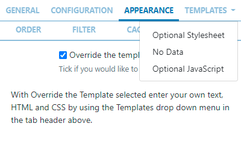

<!--toc=widgets-->

# DataSet View

Display information held in a DataSet in a tabular format on Layouts.

{feat}DataSet View Widget|v3{/feat}

When the underlying **DataSet Data** is changed, the DataSet View Widget included in the Layout, will update with the new data.

DataSets need to be created and defined prior to adding the DataSet View Widget to Layouts. Please see the [DataSet](media_datasets.html)  page for further information.

## Add Widget

Locate **DataSet View** from the [Widget](layouts_widgets.html) toolbar and click to **Add** or **Grab** to drag and drop to a Region.

{version}
NOTE: If you are using a 1.8.x CMS, select DataSet View from the Widget Toolbox to add!
{/version}

- On adding, select the DataSet to use from the drop-down menu.

{version}
NOTE: From v3.1.0 you can change to an alternative DataSet by clicking the Back button. Options will  need to be reconfigured to suit the new DataSet!

If you are using a version earlier than 3.1.0 you cannont edit to change to an alternative set of data. A new Widget would need to be added and configured!
{/version}

Once Saved, further options will be made available:

- Provide a **Name** for ease of identification.
- Choose to override the default **duration** if required.
- Select whether the duration is to be per page or leave unticked to use the overall Widget duration.

### Configuration


- Choose which columns to use by dragging to **Columns Selected**. 
- Tick in the box to show the **Table Headings**.
- Configure **Upper** and **Lower** row limits.
- Split the data over multiple pages using **Rows per Page**.

### Appearance

- Select a **Template** using the drop-down menu:


{version}
NOTE: Additional Templates are available from v3.0.0!
{/version}

- The first template option is customisable and allows users to select colouring for background, border, font, select a custom font and font size to use.
- The other templates allow for a user to select a custom font and size.
- Enter HTML and CSS by ticking to Override a selected template. 
- Click on the Templates tab to select the Template to edit:




### Optional StyleSheet

Include CSS to apply to the template structure when overriding templates. 

{tip}
This optional template is intended for advanced users to 'tweak' the CMS generated output. Scroll to the bottom of this page to view an example style sheet!
{/tip}

### No Data Template

Include a message to ensure that your audience is not left with blank displays when there is no data to display.

### Order

DataSet results can be set and ordered by any column:

- Select the column to order from the drop down menu.

- Click the `+` button to add additional fields.
- Use the advanced order clause for more complex ordering by providing a SQL command.

### Filter

DataSet results can be filtered by any column:

- Use the clause builder to include/omit DataSet results
- Click the `+` button to add additional fields.
- Use the advanced filter clause for more complex filtering by providing a SQL command.

### Caching

Players can **cache** the content of this media for off-line playback and to prevent repeated downloads. Keep this number as high as possible.

{version}
NOTE: From v3.0.0 users can set a 'freshness check' to determine when to switch to the **No Data Template** when a Player is offline.
{/version}

## Actions 

**Available from v3.0.0**

Interactive Actions can be attached to this DataSet View Widget from the **Actions** tab. Please see the [Interactive Actions](layouts_interactive_actions.html) page for more information.

## Example Style Sheet

```css
table.DataSetTable {
font-family:"Trebuchet MS", Arial, Helvetica, sans-serif;  
width:100%;
border-collapse:collapse;
}

tr.HeaderRow {
font-size:1.1em;
text-align:center;
padding-top:5px;
padding-bottom:4px;
background-color:#A7C942;
color:#ffffff;
}

tr#row_1 {
color:#000000;
background-color:#EAF2D3;
}

td#col_1 {
color:#000000;
background-color:#EAF2D3;
}

td.DataSetColumn {
color:#000000;
background-color:#EAF2D3;
border:1px solid #98bf21
}

tr.DataSetRow {
text-align:center;
color:#000000;
background-color:#EAF2D3;
border:1px solid #98bf21
padding-top:5px;
padding-bottom:4px;
}

th.DataSetColumnHeaderCell {
font-size:1em;
border:1px solid #98bf21;
padding:3px 7px 2px 7px;
}

span#1_1 {

}

span.DataSetColumnSpan {

}
```