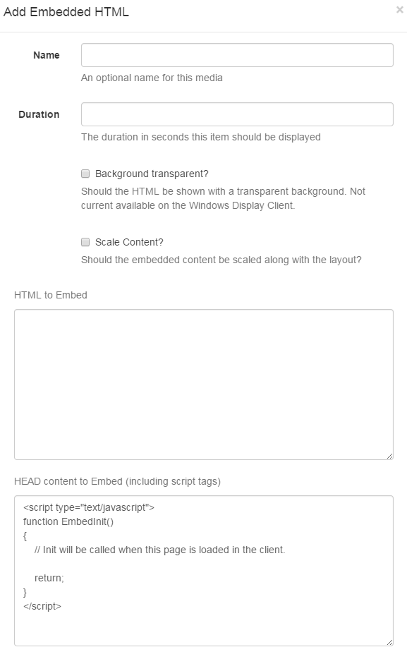

<!--toc=widgets-->
# Embedded Content
The Embedded Content module allows HTML and JavaScript to be embedded into a Layout Region. This allows for custom enhancements to be made to [[PRODUCTNAME]] without modifying the core application. Examples of where this might be useful are displaying a Clock or Weather region.



- **Duration**

    The duration in seconds that this item should remain in the Region.

- **Transparent?**

    Should the item be rendered with a transparent background? [[PRODUCTNAME]] will try its best to do this when checked, however it may be overridden by the custom content.

- **HTML Content**

    The HTML that should be loaded into the Region.

- **HEAD content**

    Any content to put in the HEAD of the document - JavaScript should be wrapped in `script` tags. [[PRODUCTNAME]] will automatically add jQuery.

    The `EmbedInit()` method will be called by the Display Client and can be used to safely start any custom JavaScript at the appropriate time. The method is defaulted on any new Embedded Media Item.

    ``` html
    <script type="text/javascript">
    function EmbedInit()
    {
        // Init will be called when this page is loaded in the client.

        return;
    }
    </script>
    ```

Show embedded HTML with Active-X content on the Windows Display Client the security settings of IE so that local files were allowed to run active content by default. This can be done in Tools -> Internet Options -> Advanced -> Security -> "Allow Active content to run in files on My Computer"
