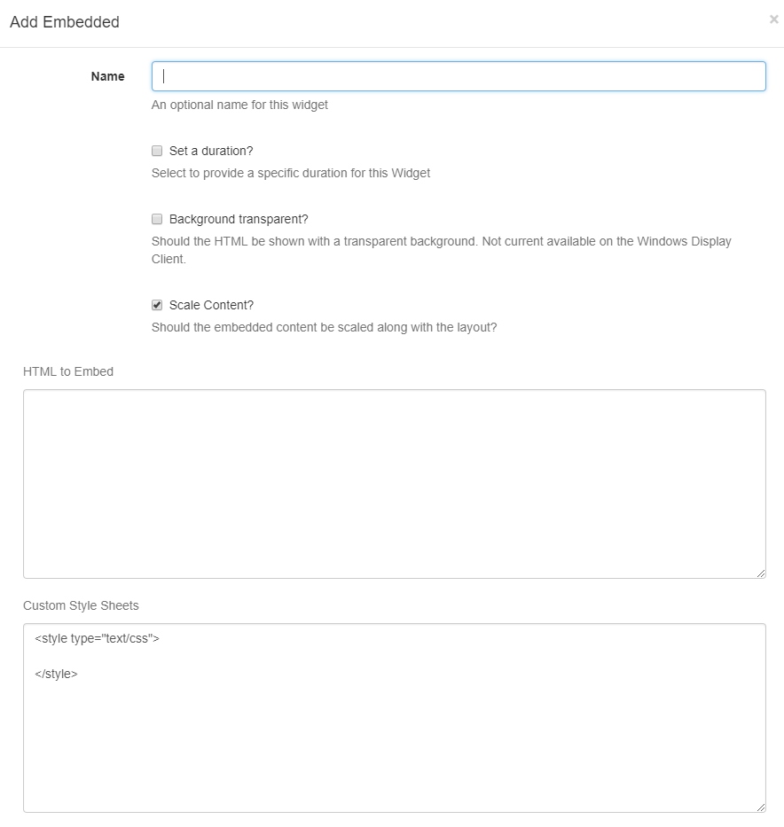

<!--toc=widgets-->
# Embedded Content
The Embedded Content Widget allows HTML and JavaScript to be embedded into a **Region** on a Layout. This allows for custom enhancements to be made to [[PRODUCTNAME]] without modifying the core application. 

{tip}
Examples of where this might be useful are displaying a Clock or Weather region.
{/tip}



- Optionally set a duration to override the default.
- Select whether the item should be shown with a transparent background. This is currently not available on the Windows Display Client.

{tip}
 [[PRODUCTNAME]] will try its best to do this when checked, however, it may be overridden by the custom content.

{/tip}

- Should the embedded content be scaled along with the Layout?

#### **HTML to Embed**

The HTML content that should be loaded into the Region.

#### **Custom Style Sheets**

A CSS style sheet to control the visual styling.

#### **HEAD content**

Any content to put in the HEAD of the document - JavaScript should be wrapped in `script` tags. [[PRODUCTNAME]] will automatically add jQuery.

The `EmbedInit()` method will be called by the Display Client and can be used to safely start any custom JavaScript at the appropriate time. The method is defaulted on any new Embedded Media Item.

``` html
<script type="text/javascript">
function EmbedInit()
{
    // Init will be called when this page is loaded in the client.

    return;
}
</script>
```

{tip}

Show embedded HTML with Active-X content on the Windows Display Client the security settings of IE so that local files were allowed to run active content by default. This can be done in Tools -> Internet Options -> Advanced -> Security -> "Allow Active content to run in files on My Computer".

{/tip}