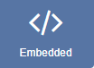
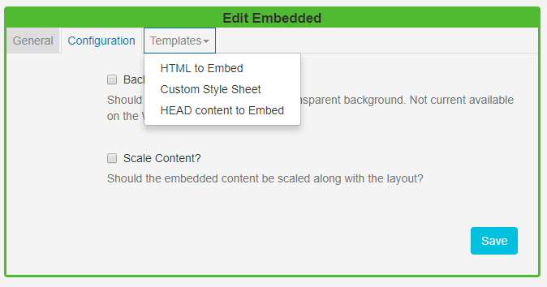
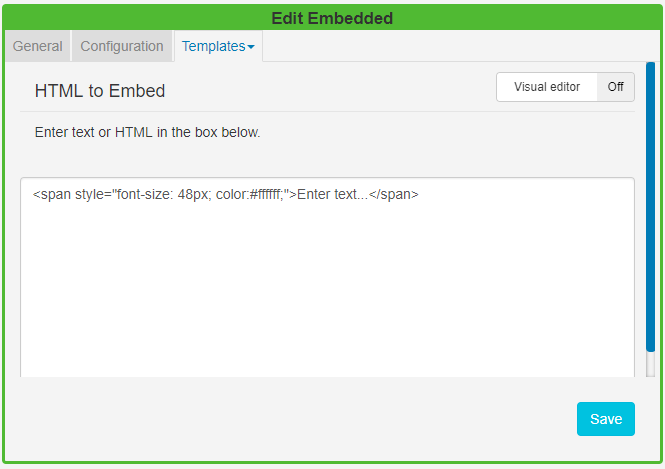

<!--toc=widgets-->

# Embedded Content

The Embedded Content Widget allows HTML and JavaScript to be embedded into a **Region** on a Layout. This allows for custom enhancements to be made to [[PRODUCTNAME]] without modifying the core application. 

{tip}
Examples of where this might be useful are displaying a Clock or Weather region.
{/tip}

Click on the **Embedded Widget** on the toolbar,  add / drag to the target **Region**.  

{tip}
If you are using 1.8, select **Embedded** from the Widget Toolbox to add to your Region Timeline and complete the form fields as explained below.
**Please note:** The Visual editor is not available in the 1.8 series CMS for this Widget.
{/tip}

### General

- Provide an optional name
- Choose to override the default duration

### Configuration

- Select whether the item should be shown with a transparent background. 
  **Please note:** This is currently not available on the Windows Player.

{tip}
[[PRODUCTNAME]] will try its best to do this when checked, however, it may be overridden by the custom content.
{/tip}

- Select to scale embedded content along with the layout.

### Templates



### HTML to Embed

Complete HTML in the box provided or toggle **On** the Visual editor to use the inline editor to enter text and format. Click in the preview window to open the text editor.




### Custom Style Sheets

Use a CSS style sheet to control the visual styling.

### HEAD content to Embed

Any content to put in the HEAD of the document - JavaScript should be wrapped in `script` tags. [[PRODUCTNAME]] will automatically add jQuery.

The `EmbedInit()` method will be called by the Player and can be used to safely start any custom JavaScript at the appropriate time. The method is defaulted on any new Embedded media Item.

```html
<script type="text/javascript">
function EmbedInit()
{
    // Init will be called when this page is loaded in the client.

    return;
}
</script>
```

{tip}
Show embedded HTML with Active-X content on a Windows Player, with the security settings of IE, so that local files are allowed to run active content by default. This can be done in Tools -> Internet Options -> Advanced -> Security -> "Allow Active content to run in files on My Computer".
{/tip}