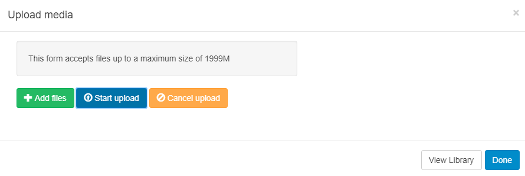

<!--toc=widgets-->

# Flash

The Flash Module allows for **SWF file** uploads. Include the Flash Widget to Layouts to upload files using the **Upload Media** form.

## Supported Players

| Display | Supported? | Remarks                                            |
| ------- | ---------- | -------------------------------------------------- |
| Android | No         | Not supported, see note.                           |
| Windows | Yes        |                                                    |
| webOS   | Yes        |                                                    |
| Linux   | Partial    | Support via the browser component can be unstable. |

**Please note:** As Adobe has discontinued development and support for this application the Flash Module is no longer supported on Android. After extensive testing, it was found that instabilities in the Player could cause the Player to close. Should you still choose to run via the Flash Module or on embedded websites, it will render using the Flash application if available. However, if you have stability problems with your device this may be due to the running of Flash content.