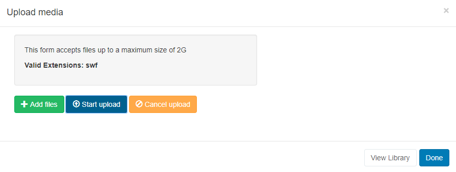

# Flash

{version}
IMPORTANT: As Adobe no longer supports Flash, it will be naturally phased out over a period of time. Whilst Players may still play flash at this current time, updates to operating systems and other third party components, such as the browser, may render Flash files as unplayable.

If you are using a 3.x CMS, please use the following link: [Flash](media_module_flash.html)
{/version}

The Flash Module allows for **SWF file** uploads to the Library which can be assigned to Layouts.

{feat}Adobe Flash Widget|v2{/feat}

{version}
NOTE: As Adobe has discontinued development and support for this application the Flash Module is no longer supported on Android. After extensive testing, it was found that instabilities in the Player could cause the Player to close. Should you still choose to run via the Flash Module or on embedded websites, it will render using the Flash application if available. However, if you have stability problems with your device this may be due to the running of Flash content.
{/version}

Click on the **Flash Widget** on the toolbar,  add / drag to the target **Region**.

{version}
If you are using 1.8 select **Flash** from the Widget Toolbox to add to your Region Timeline.
{/version}

Click on **Add files** to upload to the Library or click on View Library to select an uploaded file.

{tip}
If the SWF file has already been uploaded to the Library use the [Library Search](layouts_library_search.html) tab to quickly and simply add to a Region.
{/tip}