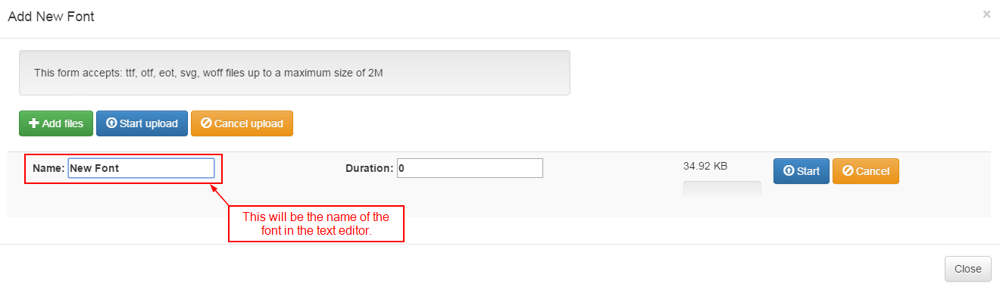
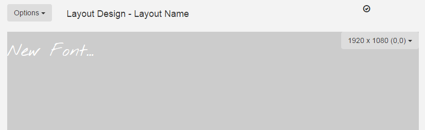

<!--toc=widgets-->
#Font
[[PRODUCTNAME]] comes with a set of standard fonts provided by our text editor tool - CKEditor.

The font module allows extra fonts to be added to the CMS and display clients.

The font module is a library based module and requires fonts to be added from the library page.

##Adding a new font
Adding and Installing a font is a two step process - firstly the font must be uploaded using the Add Form.

Secondly the font must be installed by opening the Edit form and pressing OK.

##Layout Designer
Once added the font will be available in the editor

**If the new font doesn't show, try clearing the browser cache.**

And will preview correctly

##Displays
Fonts are automatically added to the download list of every Display. Once downloaded any display that has text based content will use the added font.
