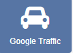
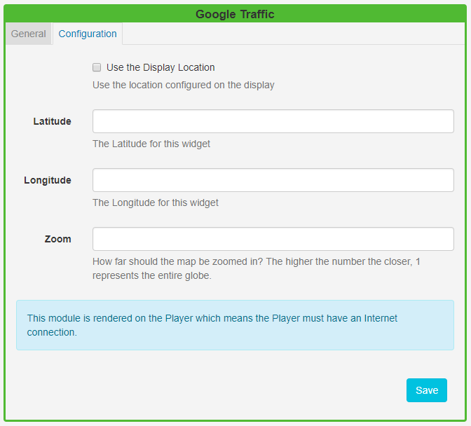

<!--toc=widgets-->

# Google Traffic

**This Module requires a Google API key which has associated usage charges. Please make sure you are aware of the usage charges before entering your key in this Module's configuration**.

### Configuration

The Google Traffic Module must be configured with a Google Maps API key before use. The "[get a key](https://developers.google.com/maps/documentation/javascript/get-api-key)" documentation describes the process and differences between the keys.

Once a key is obtained it should be entered on the **Module** page under the Administration section of the menu. This page also contains a setting for the **default duration** and the **minimum duration**. Please make sure you understand these two settings and configure them in a suitable way for your environment. 

**Please note:** The Google API is charged per map load and therefore how long the Widget remains on screen has a direct relation on the charges you will accrue.

{tip}
Until an API key is entered the Widget will not render in the Layout Designer or the Player, although you can still add the Widget to your layouts.
{/tip}

{tip}

This Module requires a **valid internet connection** on the Player in order to function.

{/tip}

### Terms

The Google Maps API terms of use must be read and understood before using this Module. At the time of writing these terms can be found [here](https://developers.google.com/maps/terms).

## Add Traffic data to a Layout

Click on the **Google Traffic Widget** on the toolbar,  add / drag to the target **Region**.  

{tip}
If you are using 1.8, select **Google Traffic** from the Widget Toolbox to add to your Region Timeline and complete the form fields as explained below.
{/tip}

### General

- Provide an optional name
- Choose to override the default duration

### Configuration

- Use the Display location checkbox to use the lat/long recorded on the display rather than specifying manually.
- Select how close/far away the aerial view of the map will be. The higher the number entered the closer the view to ground level will be with a zoom of 1 being the whole globe.

{tip}
Use the display location so that you can have 1 Layout of **Traffic Data** that can be reused on multiple Displays to show the traffic in the correct location on each Display.

{/tip}