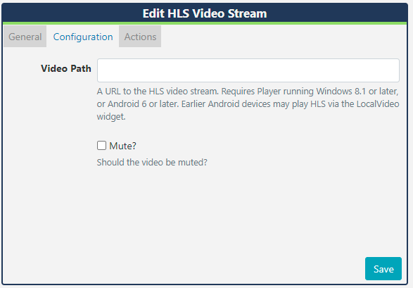

<!--toc=widgets-->

# HLS

- Add the HLS Video Stream Widget to show **live streamed content** on Layouts. 

  **Please note:** This Widget requires a Player running Windows 8.1 or later/Android 6 or later. Earlier Android devices may play HLS using the [Local Video](media_module_localvideo.html) Widget. 
  
  This Module is currently not supported with the Linux Player.
  
  {tip}
  This Widget requires a valid internet connection on the Player in order to function.
  {/tip}
  
  ## Add Widget
  
  Click on **HLS** from the [Widget](layouts_widgets.html)  toolbar and click to add or drag and drop 
  
  {tip}
  If you are using a 1.8.x CMS, select HLS from the Widget Toolbox to add!
  {/tip}
  
  On adding, configuration options are shown in the Edit HLS form:
  
  - Provide a **Name** for ease of identification.
  - Choose to override the default **duration** if required.
  
  ### Configuration
  
  
  
  - Provide a **URL** to the HLS Video stream.
  
  - Use the checkbox to mute/unmute the video stream.
  
  ## Actions 
  
  **Available from v3.0.0**
  
  Actions can be attached to this Widget, please see the [Interactive Actions](layouts_interactive_actions.html)  page for more information.