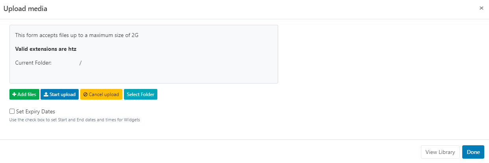

<!--toc=widgets-->

# HTML Package

{tip}
If you are using a 2.0.x CMS please use the following link: [HTML Package](media_module_htmlpackage_2.html)
{/tip}

{tip}
**Please note:** This module is currently not supported for the Linux Player.
{/tip}

The HTML Package Module allows for the upload of a complete HTML Package which can be distributed to Players.

## Add Widget

Click on **HTML Package** from the [Widget](layouts_widgets.html) toolbar and click to add or drag and drop. 

{tip}
Use the [Library Search](layouts_library_search.html) function to add PowerPoint files already uploaded to the Library.
{/tip}

From v3.1.0 use the **Library other media search** and filter by **Type** to select **Upload new** and add to a Layout:

## Upload Media File

The file uploader will open on adding the HTML Package Widget:

- Click on **Add files** and select the file(s) to upload

- Give your file a **Name** for easier identification in the CMS and an optional **Tag**.

{tip}
If the Name field is left blank, the file will be named as per the original file name on upload!
{/tip}

HTML Packages can also be directly uploaded to a specified **Folder** location.

{tip}
HTML Packages that are saved in Folders will inherit the View, Edit, Delete [Share](users_features_and_sharing.html) options that have been applied to the destination Folder for User/User Group access!
{/tip}

- Click on the **Select Folder** button and expand to select a Folder to save in.
- Users can also right click a Folder to access further options.

{tip}
Available Folder options are based on enabled [Feature and Sharing](users_features_and_sharing.html) options for a User/User Group.
{/tip}

- Click in the folder you wish to upload the file to and click **Done**. 
- The **Current Folder** will show the selected file path.

{nonwhite}
Further information for Administrators regarding Folder access and set-up can be found [here](https://xibo.org.uk/docs/setup/folders-administration)
{/nonwhite}

{white}
For further information regarding Folder access and set-up, please speak to your Administrator.
{/white}

There is an option to **Set Expiry Dates** and times for files uploaded to this particular Widget.

- Tick the **Set Expiry Dates** box.

- Use the date picker to select **Start** and **End** dates and times.

- Click the **Start upload** button to begin the upload. 
- Once successfully uploaded, click **Done**.

Files can also be uploaded individually and have different Folder locations/Expiry dates and times specified.
Instead of clicking on the Start upload button, click on the **blue upload** button shown at the end of the row for an added file after changing the Folder location and Expiry dates, to upload individually.

{tip}
View or make changes to Expiry Dates by clicking on the icon on the Widget from the Timeline!
{/tip}

## Configuration Options

Click on the added **HTML Package Widget** from the **Timeline** to open configuration options in the **Edit HTML Package** form:

- Using the General tab, make edits to the Name and provide a specific duration as required.
- Enter a file name for the Player to attempt to open after extracting the .htz archive.
- Save any changes.

### Actions

Actions can be attached to this Widget, please see the [Interactive Actions](layouts_interactive_actions.html) page for more information.

