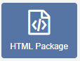
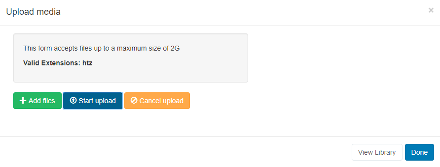

# HTML Package

If you are using a 3.x CMS, please use the following link: [HTML Package](media_module_htmlpackage.html)

**Please note:** This Module is available from v2

{tip}
This module is currently not supported for the Linux Player.
{/tip}

The HTML Package Module allows for the upload of a complete HTML Package which can be distributed to Players.

{tip}
If the file has already been uploaded to the Library use the [Library Search](layouts_library_search.html) tab to quickly and simply add to a Region.
{/tip}

Click on the **HTML Package Widget** on the toolbar,  add / drag to the target **Region**.  

Click on **Add files** to upload to the Library or click on View Library to select an uploaded file.

