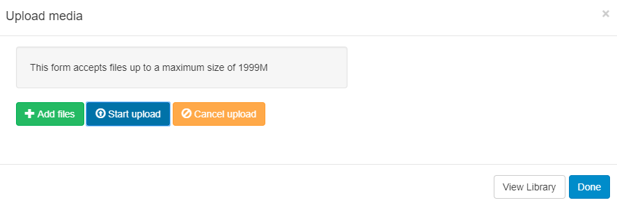

<!--toc=widgets-->

# Image

Add an image to a Layout using the Image Widget, by adding a file to upload directly or choosing an image that has already been added to the [Library](media_library.html). 

**Caution should be taken as uploading very large Images can cause issues for the Player.**

<tip>

We recommend uploading JPG or PNG files, ensuring that Users check the resolution of the Image and keep it within the intended screen size.

</tip>

## Edit/Delete/Permissions

Once assigned to the Region Timeline, **Edit, Delete** and **Permission** functions can be selected.

**Please note:** Animated GIF’s are not supported on any Player.

**As [[PRODUCTNAME]] takes no measures to control what content is put on your Displays, it is your responsibility to ensure that any images used are appropriately attributed if you do not own the rights.**

