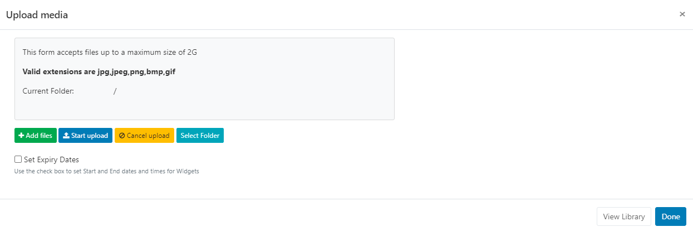
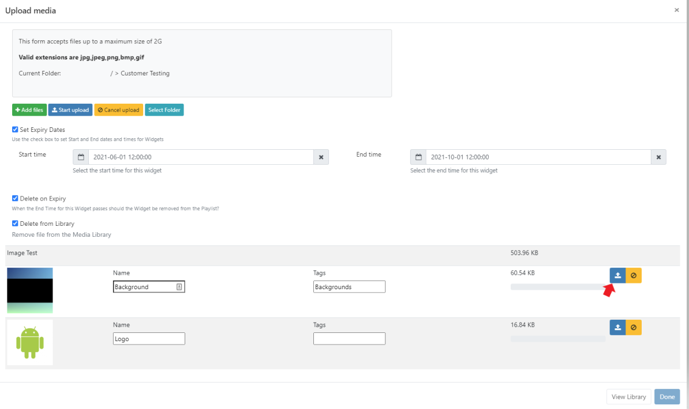

<!--toc=widgets-->

# Image

{tip}
If you are using a CMS earlier than v3.0.0 please use the following link: [Image](media_module_image_2.html)
{/tip}

The Media Module allows for images to be shown when assigned to a Timeline. Image files are uploaded to the [Library](media_library) 

## Add Widget

Click on **Image** from the [Widget](layouts_widgets.html) toolbar and click to add or drag and drop.  

{tip}
If the Image file has already been uploaded to the Library use the [Library Search](layouts_library_search.html) tab to quickly and simply add!
{/tip}

## Upload Media File

The file uploader will open on adding the Image Widget:

- Click on **Add files** and select the file(s) to upload

{tip}
We recommend uploading JPG or PNG files, ensuring that users check the resolution of the Image and keep it within the intended screen size.
Animated gif's are not supported on any Player.
{/tip}

**Caution should be taken as uploading very large Images can cause issues for the Player.**

{tip}
Files can also be added via drag and drop!
{/tip}

- Give your file a **Name** for easier identification in the CMS and an optional **Tag**.

{tip}
If the Name field is left blank, the file will be named as per the original file name on upload!
{/tip}

Image files can also be directly uploaded to a specified **Folder** location.

{tip}
Image files that are saved in Folders will inherit the View, Edit, Delete [Share](users_features_and_sharing.html) options that have been applied to the destination Folder for User/User Group access!
{/tip}

- Click on the **Select Folder** button. Expand to select an existing Folder or right click and **Create** a new Folder.

{tip}
Available Folder options are based on enabled [Feature and Sharing](users_features_and_sharing.html) options for a User/User Group.
{/tip}

- Click in the folder you wish to upload the file to and click **Done**. The **Current Folder** will show the selected file path:

{tip}
The above image shows image files will be uploaded to `  />Example Folder` 
{/tip}

{nonwhite}
Further information for Administrators regarding Folder access and set-up can be found [here](https://xibo.org.uk/docs/setup/folders-administration)
{/nonwhite}

{white}
For further information regarding Folder access and set-up, please speak to your Administrator.
{/white}

There is an option to set expiry dates and times for files uploaded to this particular Widget.

{tip}
This is particularly useful should you need to preload images to be shown at a later date/time!
{/tip}

- Tick the **Set Expiry Dates** box.

- Use the date picker to select **Start** and **End** dates and times.

- Further options are available to remove the Widget from the Playlist on expiry and to delete the media file from the Library.

- Click the **Start upload** button to begin the upload of all files added. If a Folder/Expiry Dates have been selected and there are multiple files to be added, all files will be uploaded to the specified location and have the same Expiry Dates set.
- Once successfully uploaded, click **Done**.

Files can also be uploaded individually and have different Folder locations/Expiry dates and times specified.
Instead of clicking on the Start upload button, click on the **blue upload** button shown at the end of the row for an added file. 

Change the Folder location using the **Select Folder** button as before and then click the blue button at the end of the row to upload just that singular file.

- Once all files have been individually uploaded, click **Done**.

{tip}
View or make changes to Expiry Dates by clicking on the icon on the Widget from the Timeline!
{/tip}

### Configuration Options

Click on the added **Image Widget** from the **Timeline** to open configuration options in the **Edit Image** form:

- Make edits to naming of the Widget if required
- Tick the **Set a duration** to provide a specific duration in seconds.

- Use the **Appearance** tab to change the settings for scale and alignment of the image.

### Actions

Actions can be attached to this Widget, please see the [Interactive Actions](layouts_interactive_actions.html) page for more information.

**As [[PRODUCTNAME]] takes no measures to control what content is put on your displays, it is your responsibility to ensure that any images used are appropriately attributed if you do not own the rights.**