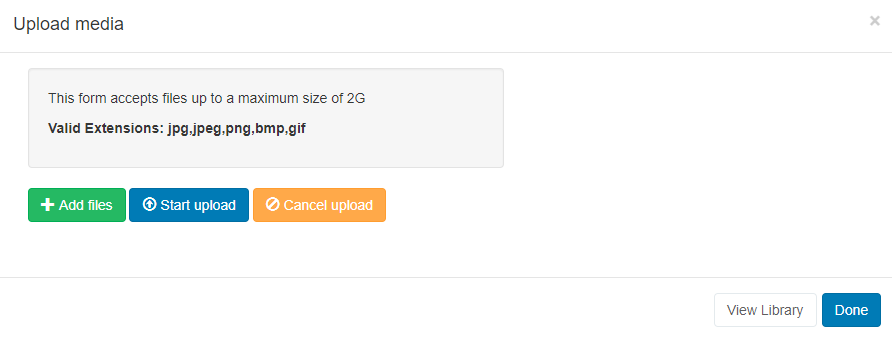

# Image

Display images on Layouts.

{version}

- If you are using a 3.0.x CMS, please click [here](media_module_image_3.html)

- If you are using a 3.1 or later CMS, please click [here](media_module_image.html)

{/version}

Click on the **Image Widget** on the toolbar,  add / drag to the target **Region**.  

{tip}
If the Image file has already been uploaded to the Library use the [Library Search](layouts_library_search.html) tab to quickly and simply add to a Region.
{/tip}

{version}
NOTE: If you are using a CMS v1.8, select **Image** from the Widget Toolbox to add to your Region Timeline.
{/version}

Click on **Add files** to upload to the Library or click on View Library to select an uploaded file.

{tip}
We recommend uploading JPG or PNG files, ensuring that users check the resolution of the Image and keep it within the intended screen size.
{/tip}

**Caution should be taken as uploading very large Images can cause issues for the Player.**

Once assigned to a Region, **Edit** options are available.

{tip}
**Please note:** Animated GIF’s are not supported on any Player.
{/tip}

**As [[PRODUCTNAME]] takes no measures to control what content is put on your displays, it is your responsibility to ensure that any images used are appropriately attributed if you do not own the rights.**