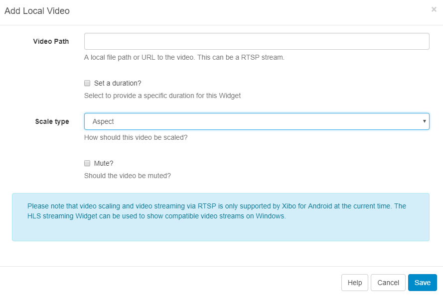

<!--toc=widgets-->

# Local Video

The Local Video Module is used for video that exists only on the Display and is not uploaded to the CMS, such as; 

\- Manually transferred videos

\- Videos on a LAN

\- Streamed Videos

## Add Local Video

Complete a local file path or URL to the video, this can be an RTSP Stream.

- Optionally Set a duration to override the default.
- Use the drop down to select how the video should be **scaled**.
- Use the checkbox to mute/unmute the video.

{tip}

Video scaling and RTSP streams are only supported on the Android and webOS Players. Use the HLS Widget to show compatible video streams on Window Players.

{/tip}