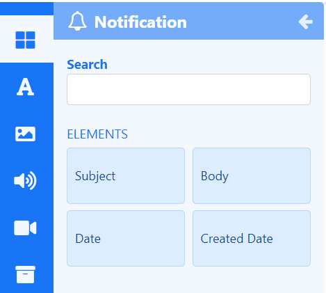

# Notifications

Display [Notification](users_notifications.html) data anywhere on a Layout using **Elements**.

{feat}Notification|v4{/feat}

## Notification Elements

[Elements](layouts_editor#content-data-widgets-and-elements) are available for selection when adding the Notification Widget to a [Layout](layouts_editor.html) to give Users more control over what components of Notifications to use and where they can be placed.

Each Element has a set of configuration options in the Properties Panel. Control how items should be cycled by specifying a [Data Slot](layouts_editor.html#content-data-slots) to use for each of the added Elements. Data Elements can be further complimented by adding [Global Elements](layouts_editor.html#content-global-elements) to add shapes and text which can all be put into an [Element Group](layouts_editor.html#content-grouping-elements) for easier configuration and positioning.

## Overview

- Update Elements with new Notifications by creating them in the [Notification Drawer](users_notifications.html#content-create-notifications)
- Update content without accessing Layouts.
- Specify a maximum age in which to show messages.
- Set a duration to apply to each individual message.
- Apply a number of items to show.
- Content for this media is cached by the Players for off-line playback.

#### Next...

[Notifications](users_notifications.html)

