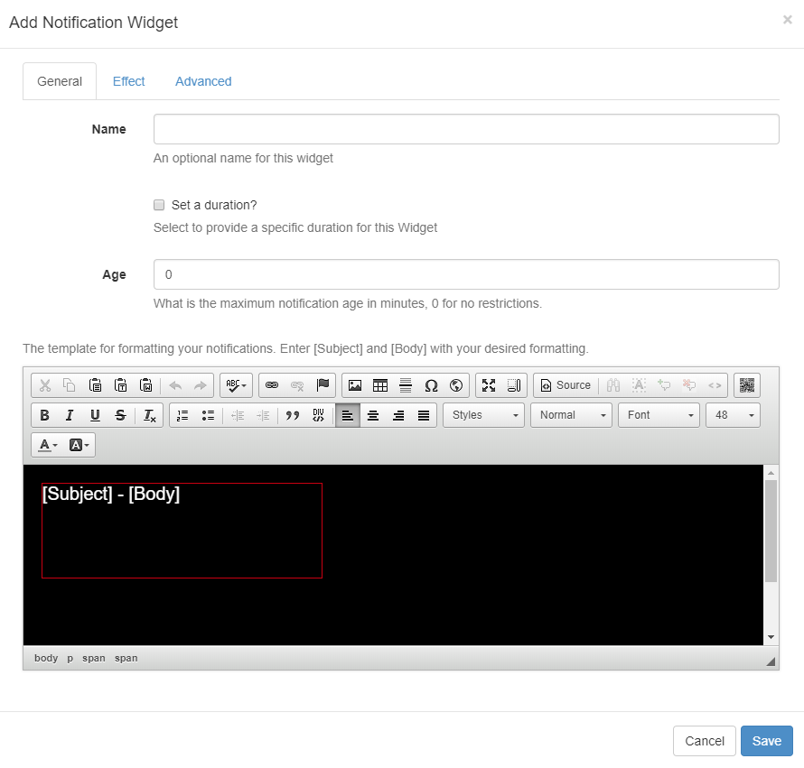

<!--toc=widgets-->

# Notifications

Add the Notification Widget to Layouts to **display messages** created in the [Notification Drawer](users_notifications.html) of the CMS. 

## Add Notification Widget

Complete the form fields on each tab.

#### **General**

- Give an optional name for the Widget.
- Optionally set a duration to override the default.
- Complete a maximum **Notification age** for messages you wish to use in this Widget.
- Format the **[Subject]** - **[Body]** field tags using the text editor.

<tip>

To ensure that the field tags stay intact and therefore display the correct fields of your message within the Notification Drawer, highlight the field tags before applying your desired format. 

</tip>

#### **Effect**

- Select an optional Effect and Speed from the drop-down menu.

#### **Advanced**

- Select if the Duration should be per Notification or a total Duration for **ALL** Notifications.
- Optionally construct and format a message to show when there are no Notifications to display.

