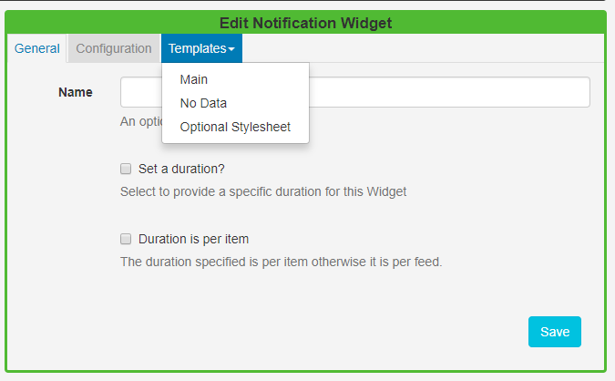
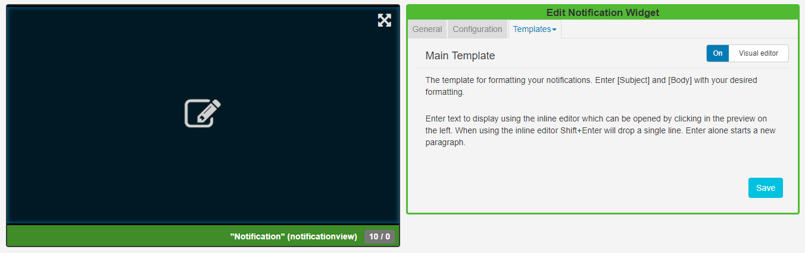

<!--toc=widgets-->

# Notifications

Add the Notification Widget to layouts to **display messages** created in the [Notification Drawer](users_notifications.html) of the CMS. 

Click on the **Notification Widget** on the toolbar,  add / drag to the target **Region**.  

{tip}
If you are using 1.8, select **Notification** from the Widget Toolbox to add to your Region Timeline and complete the form fields as explained below. 
{/tip}

### General

- Provide an optional name
- Choose to override the default duration
- Select if the duration should be per Notification or a total duration for **ALL** Notifications.

### Configuration

- Complete a maximum notification age for messages you wish to use in this Widget.
- Select an optional Effect and Speed from the drop-down menu.

### Templates

Click on the Template header to format the Notifications Template.

#### Main Template

Toggle **On** the Visual editor to format the **Main Template** using the inline editor. Click in the preview window to open.

Include text merge fields from the **Snippets** menu to pull in the **Subject** and **Body** information from the Notification Drawer. Click on the **Save** button.

### No Data

Include a message to ensure that your audience is not left with blank displays when there are no Notifications to display. 

### Optional Style Sheet

Include CSS to apply to the template structure.