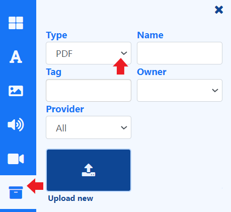

# PDF

Add PDF files to include on your Layouts and Playlists from the [Library Search](layouts_editor.html#content-library-search). 

Using the 'other media' search, use the **Type** drop down to select **PDF**.

{feat}PDF|v4{/feat}

## Overview

-  [Upload](media_library.html#content-add-media-upload) new files directly to Playlists/Layouts from the [Library Search](layouts_editor.html#content-library-search).
- Files uploaded directly to Playlists and Layouts are automatically saved to the [Library](media_library.html) for re-use.
- PDF files can be also be uploaded in advance to the Library.
- Set [start and end times](media_playlists.html#content-widget-expiry-dates) for PDF files uploaded directly to a Playlist.
- Save PDF files to [Folders](tour_folders.html#content-saving-to-folders) on upload, to easily control access to Users.
- Set a duration to apply to each page of the PDF.

{tip}
Tick the **Set a duration** box on the **Advanced** tab. The duration (in seconds) set here will be for the entire PDF or click the **Configure** tab and click in the box to apply the set duration to each individual page instead.
{/tip}

