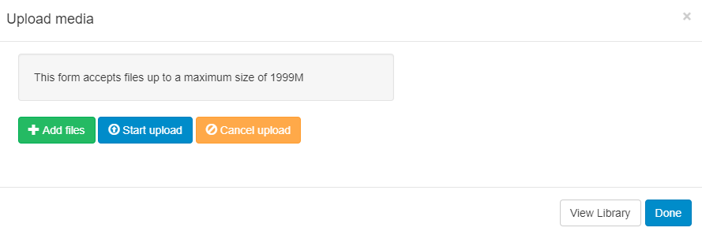

<!--toc=widgets-->
# PDF

Add and upload PDF files directly to the Library or by adding the PDF Widget to Layouts. 

[[PRODUCTNAME]] uses `pdfjs` to display PDF's on the Player and in the Layout Designer.

## Add PDF

Add a PDF to upload using the Upload Media form.

Once assigned to a Region Timeline the PDF Widget has **Edit**, **Delete** and **Permission** options.