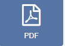

<!--toc=widgets-->

# PDF

**Please note**: If you are using a 3.x CMS, please use the following link: [PDF](media_module_pdf.html)

The PDF Module allows for the upload of PDF files to the Library which can then be added to Layouts.

{tip}
If the PDF file has already been uploaded to the Library use the [Library Search](layouts_library_search.html) tab to quickly and simply add to a Region.
{/tip}

Click on the **PDF Widget** on the toolbar,  add / drag to the target **Region**.  

{tip}
If you are using 1.8, select **PDF** from the Widget Toolbox to add to your Region Timeline.
{/tip}

Click on **Add files** to upload to the Library or click on View Library to select an uploaded file.

[[PRODUCTNAME]] uses `pdfjs` to display PDF's on the Player and in the Layout Designer.

{tip}
Increase the duration to show a PDF page for longer.
{/tip}
