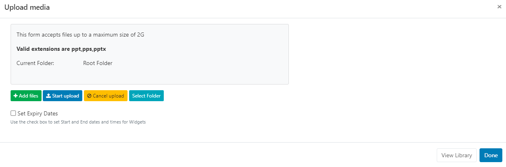
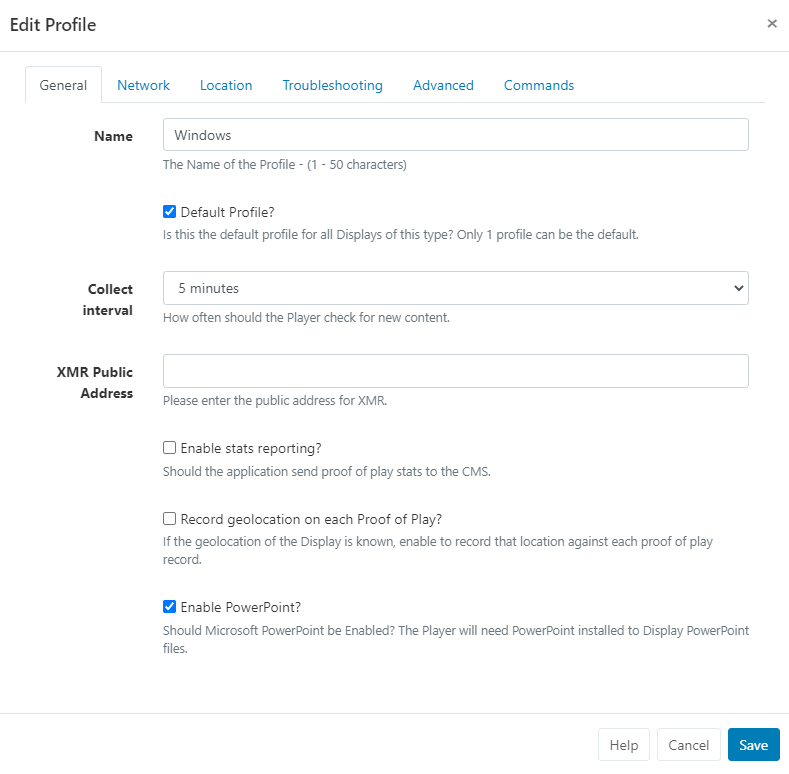

<!--toc=widgets-->

# PowerPoint

Use one of the available options to display PowerPoint files on Layouts.

{version}
NOTE: If you are using a CMS earlier than v3.0.0 please use the following link: [PowerPoint](media_module_powerpoint_2.html)
{/version}

[[PRODUCTNAME]] has 3 options to display PowerPoint PPT files.

**Option 1 -** Exported as a Video for non-Windows Players, and or, have no full copy of PowerPoint to install. (Our recommended option)

**Option 2** - Saved as a PDF for non-Windows Players, and or, have no full copy of PowerPoint to install.

**Option 3 -** Prepared and Uploaded as a PowerPoint PPT file for **Windows Players only**. Requires a full copy of PowerPoint to install on each Windows Player.

## Option 1 - Export as a Video

From Office 2010 onwards PowerPoint presentations can be exported as **Video files** which can then be uploaded to [[PRODUCTNAME]] and played using the Video Widget.

{feat}Video Widget|v3{/feat}

### Export PowerPoint file

- Export a PowerPoint by using the option on the file menu from inside the PowerPoint application. 
- Save the file with an appropriate name to be selected for upload.

{tip}
If your Players are Android or webOS devices you should ensure that the export format is MP4 (PowerPoint 2013 onwards) or convert your video to a MP4 using a 3rd party tool.
{/tip}

### Add Video Widget

Follow the instructions as detailed on the [Video](media_module_video.html) page to add and upload the file.

## Option 2 - Save as a PDF

{feat}PDF Widget|v3{/feat}

- Save your PowerPoint as a PDF.

### Add PDF Widget

Follow the instructions as detailed on the [PDF](media_module_pdf.html) page to add and upload the file.

## Option 3 - Prepare and Upload your PowerPoint PPT file

PowerPoint is a proprietary format from Microsoft and can only be displayed on a Windows-based signage player which has Microsoft PowerPoint installed.

{feat}PowerPoint Widget|v3{/feat}

### Prepare the PowerPoint Presentation.

PowerPoint will, by default, put scroll bars up the side of your presentation, unless you do the following for each PowerPoint file *BEFORE* you upload it:

1. Open your PowerPoint Document
2. Slide Show -> Set-up Show
3. Under "Show Type", choose "Browsed by an individual (window)" and then untick "Show scrollbar"
4. Click OK
5. Save the Presentation
6. Please note that [[PRODUCTNAME]] will not advance the slides in a Presentation, so you should record automatic slide timings by going to "Slide Show -> Rehearse Timings" and then save the presentation.

### Add Widget

Locate **PowerPoint** from the [Widget](layouts_widgets.html) toolbar and click to **Add** or **Grab** to drag and drop to a Region.


Use the [Library Search](layouts_library_search.html) function to add PowerPoint files already uploaded to the Library.

{version}

NOTE: From v3.1.0 use the **Library other media search** and filter by **Type** to select **Upload new** and add to a Layout:


{/version}

### Upload Media File

The file uploader will open on adding the PowerPoint Widget:



- Click on **Add files** and select the file(s) to upload

{tip}
Files can also be added via drag and drop!
{/tip}

- Give your file a **Name** for easier identification in the CMS and an optional [Tag](tour_tags.html).

{tip}
If the Name field is left blank, the file will be named as per the original file name on upload!
{/tip}

PowerPoint files can also be directly uploaded to a specified [Folder](tour_folders.html) location.

{tip}
Files that are saved in Folders will inherit the View, Edit, Delete [Share](users_features_and_sharing.html) options that have been applied to the destination Folder for User/User Group access!
{/tip}

There is an option to **Set Expiry Dates** and times for files uploaded to this particular Widget.

{tip}
This is particularly useful should you need to preload files to be shown at a later date/time!
{/tip}

- Tick the **Set Expiry Dates** box.

{tip}
**Please note:** Expiry Dates are currently not supported for the Linux Player!
{/tip}


- Select **Start** and **End** dates and times.
- Use the check boxes to remove the media file from the Playlist on expiry and delete from the Library.


- Click the **Start upload** button to begin the upload of all files added. If a Folder/Expiry Dates have been selected and there are multiple files to be added, all files will be uploaded to the specified location and have the same Expiry Dates set.
- Once successfully uploaded, click **Done**.

Files can also be uploaded individually and have different Folder locations/Expiry dates and times specified.
Instead of clicking on the Start upload button, click on the **blue upload** button shown at the end of the row for an added file after changing the Folder location and Expiry dates, to upload individually.

{tip}
View or make changes to Expiry Dates by clicking on the icon on the Widget from the Timeline!
{/tip}

### Configuration Options

Click on the added **PowerPoint Widget** from the **Timeline** to open configuration options in the properties panel:


- Make edits to naming of the Widget if required.

- Tick the **Set a duration** to provide a specific duration.

{tip}
**Please note:**  The CMS will not show a Preview for Powerpoint files!
{/tip}

### Actions

Interactive Actions can be attached to this Powerpoint Widget from the **Actions** tab in the properties panel. Please see the [Interactive Actions](layouts_interactive_actions.html) page for more information.

### Prepare your Windows Players

Install PowerPoint on your Windows PC alongside your [[PRODUCTNAME]] Player and make the following adjustments to the Windows Registry to disable the windows prompt when opening the PowerPoint. **Please ensure you have taken all necessary precautions when making these changes**.

```registry
[HKEY_CLASSES_ROOT\PowerPoint.Show.12]
"BrowserFlags"=dword:00000002
"EditFlags"=dword:00010000

[HKEY_CLASSES_ROOT\PowerPoint.Show.8]
"BrowserFlags"=dword:00000002
"EditFlags"=dword:00010000

[HKEY_CLASSES_ROOT\PowerPoint.SlideShow.12]
"BrowserFlags"=dword:800000a0
"EditFlags"=dword:00010000

[HKEY_CLASSES_ROOT\PowerPoint.SlideShow.8]
"BrowserFlags"=dword:00000002
"EditFlags"=dword:00010000
```

If you do not feel comfortable changing the registry it may be possible to achieve the same results by waiting for [[PRODUCTNAME]] to open the first PowerPoint and then when the pop-up notification appears, choose to "Open" the file, and un-check the box so you won't be prompted again.

### Enable PowerPoint on Displays

You will need to ensure that the Windows Display Profile used for the Displays you intend to use PowerPoint on, must be first enabled.

Navigate to **Display Settings** under the **Displays** section of the Main menu and locate the Windows Display Profile. Use the row menu to edit the profile. On the **General** tab tick the **Enable PowerPoint** check box and **Save**.



### Advanced Steps

When displaying PowerPoint, [[PRODUCTNAME]] is relying on Windows and PowerPoint to display the content. This means that error capture and reporting is outside the control of [[PRODUCTNAME]]. To mitigate any issues we recommend disabling Windows error notifications. This can be done by following the [steps here](https://www.lifewire.com/how-do-i-disable-error-reporting-in-windows-2626074). 

If you still experience issues, it may also be advisable to disable Office Application Error reporting by merging the registry patch below.

```reg
[HKEY_CURRENT_USER\Software\Policies\Microsoft\Office\11.0\Common]
"DWNeverUpload"=dword:00000001

[HKEY_CURRENT_USER\Software\Policies\Microsoft\Office\10.0\Common]
"DWNeverUpload"=dword:00000001

[HKEY_CURRENT_USER\Software\Policies\Microsoft\Office\12.0\Common]
"DWNeverUpload"=dword:00000001
```

{tip}**Please Note**:

The Windows player displays the PowerPoint presentation inside an Internet Explorer container. Internet Explorer uses the directory
`C:\Users\<user>\AppData\Local\Microsoft\Windows\INetCache\Content.MSO` to cache Microsoft Office temporary files that are identified as being from the Internet security zone. This can cause multiple copies of the presentation to be saved to this directory over time. Windows does not automatically remove the cached duplicates from that directory, which can consume storage space on your hard drive over time. If you find multiple copies of your presentation cached at this directory it is safe to delete them. 

We would recommend creating a scheduled task or script that will delete the contents of that directory regularly.
{/tip}


