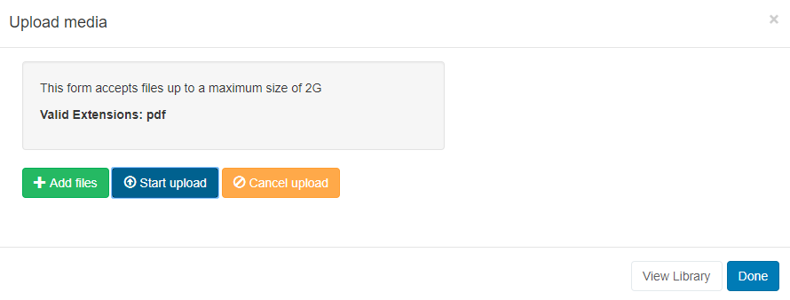
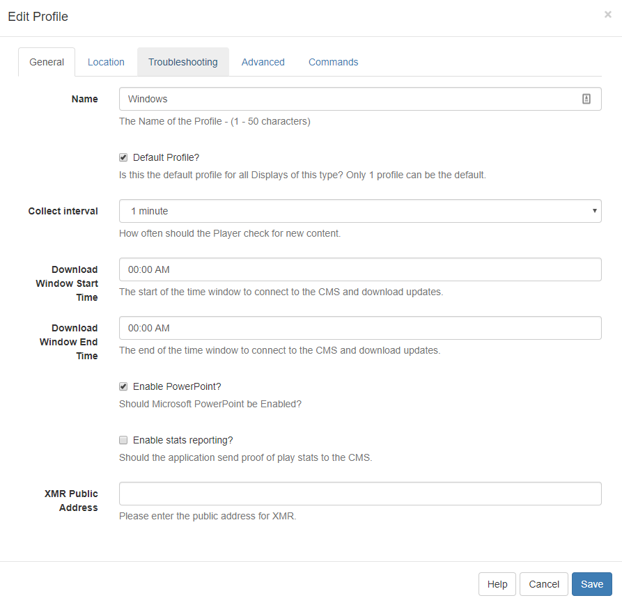

# PowerPoint

Use one of the available options to display PowerPoint files on Layouts.

{version}
NOTE: If you are using 3.x CMS, please use the following link: [PowerPoint](media_module_powerpoint.html)
{/version}

[[PRODUCTNAME]] has 3 options to display PowerPoint PPT files.

**Option 1 -** Exported as a Video for non-Windows Players, and or, have no full copy of PowerPoint to install.

**Option 2** - Saved as a PDF for non-Windows Players, and or, have no full copy of PowerPoint to install.

**Option 3 -** Prepared and Uploaded as a PowerPoint PPT file for **Windows Players only**. Requires a full copy of PowerPoint to install on each Windows Player.

## Option 1 - Export as a Video

From Office 2010 onwards PowerPoint presentations can be exported as **Video files** which can then be uploaded to [[PRODUCTNAME]] and played using the Video Widget.

{feat}Video|v2{/feat}

### Export PowerPoint

- Export a PowerPoint by using the option on the file menu from inside the PowerPoint application. Save the file with an appropriate name to be selected for upload.

{tip}

If your Players are Android or webOS devices you should ensure that the export format is MP4 (PowerPoint 2013 onwards) or convert your video to a MP4 using a 3rd party tool.

{/tip}

### Add Video Widget

Follow the instructions as detailed on the [Video](media_module_video_2.html) page to add and upload the file.


## Option 2 - Save as a PDF

{feat}PDF|v2{/feat}

- Save your PowerPoint as a PDF.

### Add PDF Widget

Follow the instructions as detailed on the [PDF](media_module_pdf_2.html) page to add and upload the file.



## Option 3 - Prepare and Upload your PowerPoint PPT file

PowerPoint is a proprietary format from Microsoft and can only be displayed on a Windows-based signage player which has Microsoft PowerPoint installed.

{feat}PowerPoint|v2{/feat}

### Prepare the PowerPoint Presentation. 

PowerPoint will, by default, put scroll bars up the side of your presentation, unless you do the following for each PowerPoint file *BEFORE* you upload it:

1. Open your PowerPoint Document
2. Slide Show -> Set-up Show
3. Under "Show Type", choose "Browsed by an individual (window)" and then untick "Show scrollbar"
4. Click OK
5. Save the Presentation
6. Note also that [[PRODUCTNAME]] will not advance the slides in a Presentation, so you should record automatic slide timings by going to "Slide Show -> Rehearse Timings" and then saving the presentation.

### Add Widget

Click on the **PowerPoint Widget** on the toolbar, add / drag to the target **Region**. 

{version}
NOTE: If you are using 1.8, select **PowerPoint** from the Widget Toolbox to add to your Region Timeline.
{/version}

{tip}
If the PowerPoint PPT file has already been uploaded to the Library use the [Library Search](layouts_library_search.html) tab to quickly and simply add to a Region.
{/tip}

Click on **Add files** to upload to the Library or click on View Library to select an uploaded file.


### Prepare your Windows Players

Install PowerPoint on your Windows PC alongside your [[PRODUCTNAME]] Player and make the following adjustments to the Windows Registry to disable the windows prompt when opening the PowerPoint. **Please ensure you have taken all necessary precautions when making these changes**.

```registry
[HKEY_CLASSES_ROOT\PowerPoint.Show.12]
"BrowserFlags"=dword:00000002
"EditFlags"=dword:00010000

[HKEY_CLASSES_ROOT\PowerPoint.Show.8]
"BrowserFlags"=dword:00000002
"EditFlags"=dword:00010000

[HKEY_CLASSES_ROOT\PowerPoint.SlideShow.12]
"BrowserFlags"=dword:800000a0
"EditFlags"=dword:00010000

[HKEY_CLASSES_ROOT\PowerPoint.SlideShow.8]
"BrowserFlags"=dword:00000002
"EditFlags"=dword:00010000
```

If you do not feel comfortable changing the registry it may be possible to achieve the same results by waiting for [[PRODUCTNAME]] to open the first PowerPoint and then when the pop-up notification appears, choose to "Open" the file, and un-check the box so you won't be prompted again.

### Enable PowerPoint on Displays

You will need to ensure that the Windows Display Profile used for the Displays you intend to use PowerPoint on, must be first enabled.

Navigate to **Display Settings** under the **Displays** section of the Main menu and locate the Windows Display Profile. Use the row menu to edit the profile. On the **General** tab tick the **Enable PowerPoint** check box and **Save**.



### Advanced Steps

When displaying PowerPoint [[PRODUCTNAME]] is relying on Windows and PowerPoint to display the content. This means that error capture and reporting is outside the control of [[PRODUCTNAME]]. To mitigate any issues we recommend disabling Windows error notifications. This can be done by following the [steps here](https://www.lifewire.com/how-do-i-disable-error-reporting-in-windows-2626074). 

If you still experience issues, it may also be advisable to disable Office Application Error reporting by merging the registry patch below.

```reg
[HKEY_CURRENT_USER\Software\Policies\Microsoft\Office\11.0\Common]
"DWNeverUpload"=dword:00000001

[HKEY_CURRENT_USER\Software\Policies\Microsoft\Office\10.0\Common]
"DWNeverUpload"=dword:00000001

[HKEY_CURRENT_USER\Software\Policies\Microsoft\Office\12.0\Common]
"DWNeverUpload"=dword:00000001
```