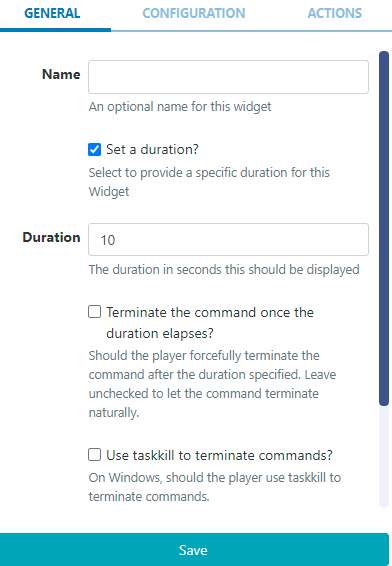
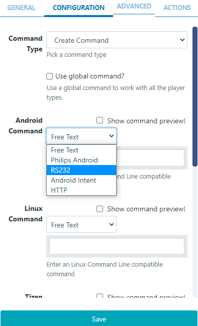

<!--toc=widgets-->

# Shell Command

{tip}
If you are using a CMS earlier than v3.0.0 please use the following link: [Shell Command](media_module_shellcommand_2.html)
{/tip}

The Shell Command Module is used to instruct the Display to execute a **Command** outside of the [[PRODUCTNAME]] environment, using the operating system shell.  

{tip}
This Module is not supported for webOS, Tizen and Linux Players.
{/tip}

{cloud}

{nonwhite}

This Module is disabled by default for **Xibo in the Cloud** Customers. If you would like to utilise the Shell Command functionality to execute actions on loading a Layout, then please contact our help desk and open a [ticket](https://xibo.org.uk/help#commercial) asking to have this Module enabled.

{/nonwhite}

{/cloud}

The Command is executed when a Layout containing the Shell Command Widget plays at its scheduled time.

A Shell command can be a **created** command string which is passed directly to the shell or a **stored command** preconfigured configured by an Administrator.

{nonwhite}
Further information regarding Command Functionality for Administrators can be found [here](https://xibo.org.uk/docs/setup/command-functionality)
{/nonwhite}

## Add Widget

Click on **Shell Command** from the [Widget](layouts_widgets.html) toolbar and click to add or drag and drop

On adding, configuration options are shown in the properties panel:

- Provide a **Name** for ease of identification.
- Tick the **Set a duration** box and provide a **Duration** to forcibly stop the process. Leave unticked to leave the command to run to its natural conclusion.

{tip}
In most cases, commands that are run from a Layout tend to be background commands which trigger something to happen like screen on/off or restart the device etc. In such cases, leave the box unticked.

If you need to run a command for a fixed period of time, for example where your command shows something on the screen for a time and cannot close itself, [[PRODUCTNAME]] can be instructed to terminate the command it started running by ticking the box and specifying a duration.
{/tip}

### Configuration

- Use the drop down to select from the **Command Type** options:
  - **Stored Command** - allows a user to pick a predefined command from the drop down menu.
  - **Create Command** - use the command builder and select from the available options to create a command.

- 
  Select **Free Text** to enter a command string or use the drop down menu to select from the available Commands to configure.

- Tick to use a global command and enter a Command Line compatible command to work with all Player types.

With Create Command selected, an **Advanced** tab is made available to enable launching the command via Windows Command Line (cmd.exe).

{tip}

Add the Shell Command Widget to Layouts to execute external commands, such as ‘volume up’ for a Layout with an Audio Widget that is set to play, and ‘volume down’ when the Layout finishes.

For commands that are executed on a specific date/time, such as  ‘reboots’, 'turn on/off' on opening/closing times for example, then please see [Events](scheduling_events.html) in the Scheduling section and [Send Command](displays.html) in the Displays section of this User Manual.
{/tip}

{tip}
Android/Linux Players require **root access** to use Shell Commands.
{/tip}

## Actions

Actions can be attached to this Widget, please see the [Interactive Actions](layouts_interactive_actions.html)  page for more information.
