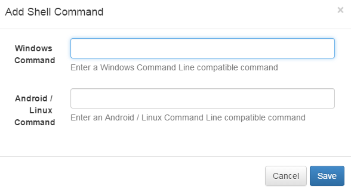

<!--toc=widgets-->
# Shell Command

The Shell Command module is used to instruct the Display to execute a command
outside of the [[PRODUCTNAME]] environment, using the operating system shell.

The Shell Command is executed when the Widget is shown on the Layout.

A Shell command can be a string which is passed directly to the shell or a
[predefined command](displays_commands.html). If a command string is specified
then an option for windows/linux is provided.

- **Windows Command**

    The Shell Command for Windows. Will be executed using `cmd.exe`.

- **Linux Command**

    The Shell Command for Linux/Android - Android players require **root
    access** to use shell commands.

Shell Commands do not have a duration, they are executed once and then expire
automatically.

## Assigning to other widgets

Shell Commands can be assigned to run at the start of other widgets. Each media
item in a play list has a command icon to indicate whether a shell command has
been assigned to it. The icon is gray if the widget doesn't have any
assignments.

## Usage

A common usage of Shell Commands is to run external commands, such as volume up,
based on the layout's activity.

[[PRODUCTNAME]] supplies some *helper* commands that can be used in predefined
commands ([list of helpers](displays_commands.html#helpers)). In most cases a
predefined command will be preferable to a command string specified in the
Layout.
