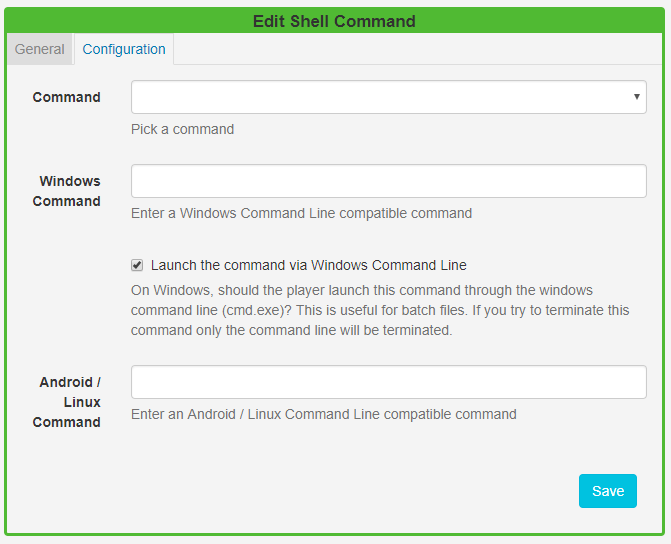

# Shell Command

The Shell Command Module is used to instruct the Display to execute a command outside of the [[PRODUCTNAME]] environment, using the operating system shell.  

{version}
NOTE:  If you are using a v3.x CMS, please use the following link: [Shell Command](media_module_shellcommand.html)
{/version}

{feat}Shell Command Widget|v2{/feat}

{cloud}

{nonwhite}

This Module is disabled by default for **Xibo Cloud Hosted** Customers. If you would like to utilise the Shell Command functionality to execute actions on loading a Layout, then please contact our help desk and open a [ticket](https://xibo.org.uk/help#commercial) asking to have this Module enabled.

{/nonwhite}

{/cloud}

The Command is executed when a Layout containing the Shell Command Widget plays at its scheduled time.

A Shell command can be an **"ad hoc"** command string which is passed directly to the shell or a **predefined** **command** configured by an Administrator.

{tip}

It is recommended that predefined commands should be used where possible. If you require additional commands, please contact your Administrator to create a new predefined command or provide a command string to include.

{/tip}

Click on the **Shell Command Widget** on the  toolbar, add / drag to the target **Region**. 

{version}
NOTE: If you are using 1.8, select **Shell Command** from the Widget Toolbox to add to your Region Timeline.
{/version}

### General

- Provide an optional name
- Choose to override the default duration

### Configuration

- Use the drop-down menu to select a command.
- If a command string is to be used, then fields are provided for Windows or Android / Linux compatible commands.

{version}
NOTE: Linux/Android Players require **root access** to use Shell Commands.
{/version}

{tip}

Shell Commands do not have a duration, they are executed once and then expire automatically.
{/tip}

Add the Shell Command Widget to Layouts to execute external commands, such as ‘volume up’ for a Layout with an Audio Widget that is set to play, and ‘volume down’ when the Layout finishes.

{tip}

For commands that are executed on a specific date/time, such as  ‘reboots’, 'turn on/off' on opening/closing times for example, then please see [Events](scheduling_events.html) in the Scheduling section and [Send Command](displays.html) in the Displays section of this User Manual.

{/tip}