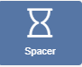
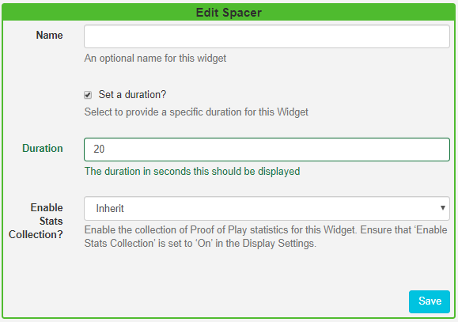

<!--toc=widgets-->

# Spacer

**Please note:** This Module is available from 2.2.0

Include the Spacer Widget to your Layouts to create an 'empty' Region for a specified duration.

Click on the **Spacer Widget** on the toolbar, add / drag to the target Region. 

Tick in the **Set a duration** box and set a duration in seconds.

{tip}
Use to set a delay to the start of Regions on a Layout so that Regions start up and play media content at different times.
{/tip}

