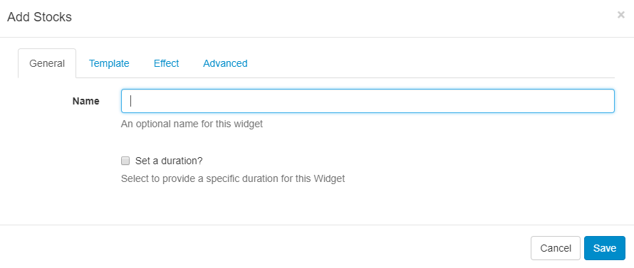
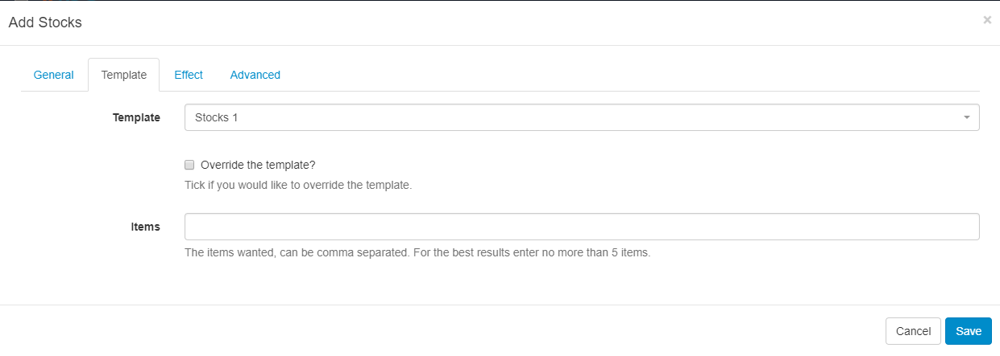

<!--toc=widgets-->
# Stocks

The Stocks Widget displays trade price information for stock listings when added to a Layout.

<nonwhite>
<cloud>

The Stocks Module is configured for **Xibo in the Cloud** customers, with an API key provided as part of the service, so please skip the Installation steps detailed below. Proceed with the set-up from the **Stocks Widget** section.
</cloud>

**Non-Xibo in the Cloud customers please follow the Installation steps as detailed below.**

</nonwhite>

## Installation 

To get an API key please visit [Alpha Vantage](https://www.alphavantage.co/support/#api-key)  and create an account.

The Stocks Module is installed from the Modules page, under the Administration section of the Menu. Click on the **Install Module** button and select the Module to install.

After installation,  select the Module from the grid and use the row menu to select **Edit**.

Complete the form fields and include the **API key** and Cache Period settings.

## Stocks Widget

Select the Stocks Widget from the Widget Toolbox to add to your Region Timeline.  Complete the form fields:

#### **General**

Give an optional name and select to override the default duration if required.

#### **Template**

- Use the drop-down menu to select a Template
- Include a **Stock Symbol** (Ticker) 

<tip>

If you need a Stock Symbol that is only quoted on a specific Exchange then you can use the format `SYMBOL:EXCHANGE` to return results. 

</tip>

#### **Effect**

Select an optional Effect and Speed

#### **Advanced**

Optionally choose a Background Colour and include a message to be displayed when no records are returned. 

<tip>

Stock Symbols can be found on various lookup sites such as [Yahoo Finance](https://finance.yahoo.com/)

</tip>