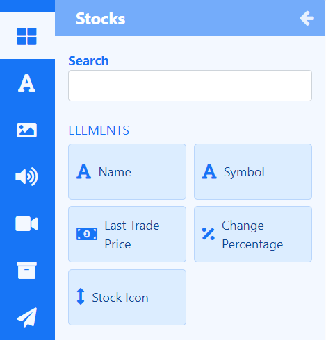

# Stocks

Display trade price information for stock listings anywhere on a Layout using **Elements** or select a **Static Template** to display results in Layouts/Playlists.

{feat}Stocks|v4{/feat}

The Stocks Widget relies in part on the [Alpha Vantage API](https://www.alphavantage.co/) to retrieve stock market data which feeds into configured Elements and Static Templates. The prices returned by Alpha Vantage follow the [stock market standard](https://medium.com/@patrick.collins_58673/stock-api-landscape-5c6e054ee631) of adjusting for corporate events such as splits and dividend payout.

{tip}
Please visit [Alpha Vantage](https://www.alphavantage.co/support/#api-key) to create an account and obtain an API key to enter into the Alpha Vantage [Connector.](media_modules.html#content-connectors)
{/tip}

{nonwhite}
{cloud}
The Currencies Module is configured for **Xibo Cloud** hosted customers with an API key provided as part of the service.
{/cloud}
{/nonwhite}

## Stocks Elements

[Elements](layouts_editor#content-data-widgets-and-elements) are available for selection when adding the Stocks Widget to a [Layout](layouts_editor.html) to give Users more control over what components of the Stocks Widget to use and where they can be placed.

Each Element has a set of configuration options in the Properties Panel.  Enter **Stock Symbols** to return results from the **Configure** tab.

{tip}
If you need a stock symbol that is only quoted on a specific exchange then you can use the format `SYMBOL:EXCHANGE` to return results. 
Stock symbols can be found on various lookup sites such as [Yahoo Finance](https://finance.yahoo.com/)!
{/tip}

Control how items should be cycled by specifying a [Data Slot](layouts_editor.html#content-data-slots) to use for each of the added Elements. Data Elements can be further complimented by adding [Global Elements](layouts_editor.html#content-global-elements) to add shapes and text which can all be put into an [Element Group](layouts_editor.html#content-grouping-elements) for easier configuration and positioning.

## Stocks Static Templates

[Static Templates](layouts_editor.html#content-static-templates) define how returned results should be laid out and styled and are a simple way to show your data using pre-styled templates.

Templates can be configured to make changes to the design appearance using a range of options in the Properties Panel. Enter **Stock Symbols** to return results from the **Configure** tab for each Template added to the Layout/Playlist.

## Overview

- Content for this media is cached by the Players for off-line playback.
- Duration can be applied per item or per page.

