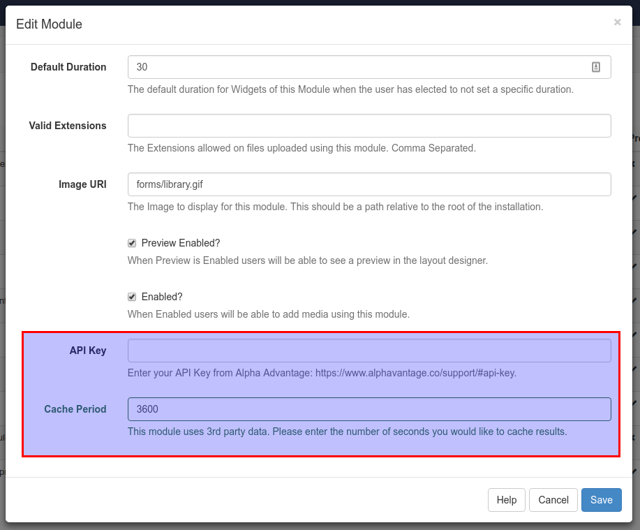

<!--toc=widgets-->
# Stocks
The [[PRODUCTNAME]] stocks Widget provides exchange rates for many currency pairs. 

<nonwhite>
If the CMS is hosted on the Spring Signage Xibo Cloud then the Stocks Widget has been configured
and is provided as part of the service.
</nonwhite>

## Installation
The Module can be installed from the CMS Modules page by selecting the "Install Module" button in the action
bar. It will be listed as "Stocks Module" on the resulting form.

After installation, find the Module in the list and select Edit.

The following form will open:

The API key and Cache Period settings must be filled in.

To get an API key please visit https://www.alphavantage.co/support/#api-key.