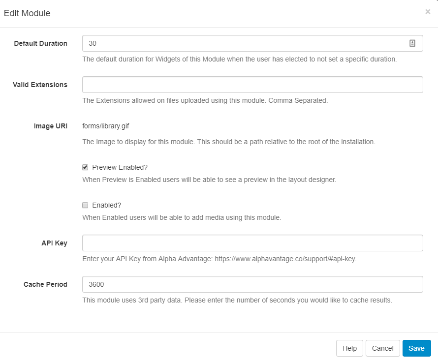
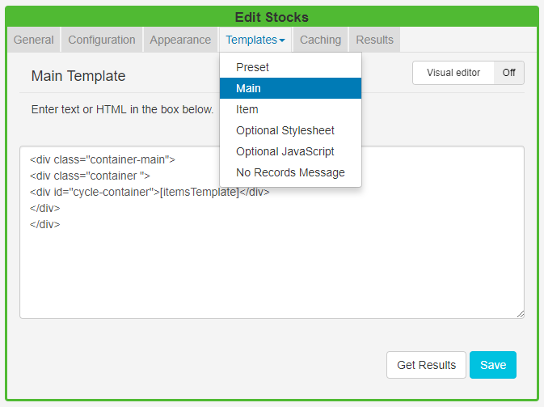
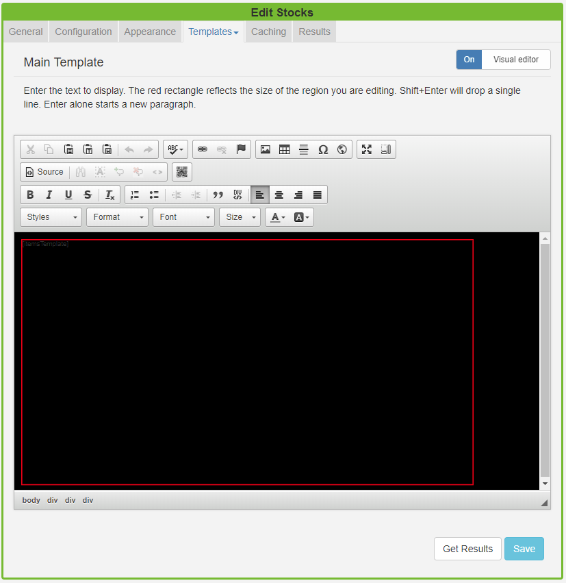

<!--toc=widgets-->

# Stocks

The Stocks Widget displays trade price information for stock listings when added to a Layout.

{nonwhite}
{cloud}

The Stocks Module is configured for **Xibo in the Cloud** customers, with an API key provided as part of the service, so please skip the installation steps detailed below. Proceed with the set-up from the **Add Stocks Widget** section.
{/cloud}

**Non-Xibo in the Cloud customers please follow the installation steps as detailed below.**

{/nonwhite}

## Installation 

To get an API key please visit [Alpha Vantage](https://www.alphavantage.co/support/#api-key)  and create an account.

The Stocks Module is installed from the Modules page, under the Administration section of the Menu. Click on the **Install Module** button and select the Module to install.

After installation,  select the Module from the grid and use the row menu to **edit**.

Complete the form fields and include the **API key** and Cache Period settings.

## Add Stocks Widget

Click on the Stocks Widget on the  toolbar, add / drag to the target **Region**. 

{tip}
If you are using 1.8, select **Stocks** from the Widget Toolbox to add to your Region Timeline and complete the form fields as explained below.
**Please note:** The Visual editor is not available in the 1.8 series CMS for this Widget.
{/tip}

### General

- Provide an optional name
- Choose to override the default duration
- Select whether the duration is per item, unticked the duration will be per page / number of items.

### Configuration

- Include a Stock Symbol (Ticker) to return results

{tip}
If you need a stock symbol that is only quoted on a specific exchange then you can use the format `SYMBOL:EXCHANGE` to return results. 
{/tip}

{tip}
Stock symbols can be found on various lookup sites such as [Yahoo Finance](https://finance.yahoo.com/)
{/tip}

### Appearance

- Optionally choose a **background colour** 
- Include a PHP **Date Format** to apply to returned results, see the bottom of the page for further information.
- Select an optional **Effect** and **Speed** to be used to transition between items.

### Templates

Select **Preset Templates** or provide your own using JavaScript.

**Edit** templates using the **Override the template** checkbox, then click on the Template header to select the template you want to edit.

{tip}
Provide a **No Records Message** to display when there are no records returned.
{/tip}

To use the inline editor toggle **On** the Visual editor.

{tip}
Get Results at anytime to see what data is returned. Any field is available as a substitute to use in the template by simply entering the field name between square brackets [].
{/tip}

### Caching

Include a suitable time for the Update Interval in minutes, keeping it as high as possible.

## Date Format - PHP

[[PRODUCTNAME]] should accept any date format that is in a correct PHP date format, the following characters are recognised and can be used:

| Format Character | Description                                                  | Example returned values                 |
| ---------------- | :----------------------------------------------------------- | --------------------------------------- |
|                  | **Day**                                                      |                                         |
| d                | Day of the month, 2 digits with leading zeros                | 01 to 31                                |
| D                | A textual representation of a day, three  letters            | Mon through Sun                         |
| j                | Day of the month without leading zeros                       | 1 to 31                                 |
| l                | (lowercase ‘L’) A full textual representation   of the day of the week | Sunday through Saturday                 |
| N                | ISO-8601 numeric representation of the day of   the week (added in PHP 5.1.0) | 1 (for Monday) through 7 (for Sunday)   |
| S                | English ordinal suffix for the day of the  month, 2 characters | st, nd, rd or th. Works well with j     |
| w                | Numeric representation of the day of the week                | 0 (for Sunday) through 6 (for Saturday) |
| z                | The day of the year (starting from 0)                        | 0 through 365                           |
|                  | Week                                                         |                                         |
| W                | ISO-8601 week number of year, weeks starting  on Monday (added in PHP 4.1.0) | 42 (the 42nd week in the year)          |
|                  | **Month**                                                    |                                         |
| F                | A full textual representation of a month, such as January or March | January through December                |
| m                | Numeric representation of a month, with leading zeros        | 01 through 12                           |
| M                | A short textual representation of a month, three letters     | Jan through Dec                         |
| n                | Numeric representation of a month, without leading zeros     | 1 through 12                            |
| t                | Number of days in the given month                            | 28 through 31                           |
|                  | **Year**                                                     |                                         |
| L                | Whether it’s a leap year                                     | 1 if it is a leap year, 0 otherwise.    |
| o                | ISO-8601 year number. This has the       same value as Y, except that if the ISO     week number (W) belongs to the previous or next year, that year is used instead. (added in  PHP 5.1.0) | 1999 or 2003                            |
| Y                | A full numeric representation of a year, 4 digits            | 1999 or 2003                            |
| y                | A two digit representation of a year                         | 99 or 03                                |