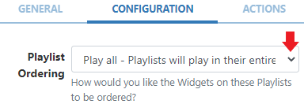
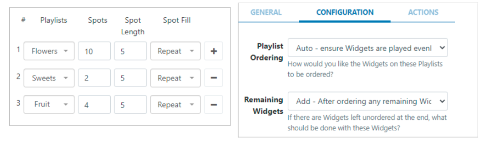
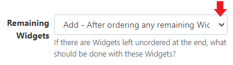

# Sub-Playlists

Sub-Playlists are used to display content added to one or multiple [Playlists](media_playlists.html)

{feat}Sub-Playlist|v3{/feat}
#### Widget Overview:

- Easily display a 'slide-show' of content held in one or more Playlists.
- Combine content from a variety of Playlists to be shown.
- Set the maximum number of items to be shown from a Playlist.
- Control how long each item on a Playlist should show before moving onto the next item.
- Set a Playlist to use its content as 'filler' only.
- Control how multiple Playlists should be ordered to play content.
- Play one item per cycle for a specified Play Count.
- Update content without accessing Layouts.

Sub-Playlists can be used to show content from Playlists managed by users without the need for the user to access the Layout itself.
Playlists are created and managed independently to Layouts, and therefore do not require further user access to Layouts or the Layout Designer to add or manage content. Edits made to a Playlist will update all Sub-Playlist Widgets on Layouts that the Playlist has been added to.

{tip}
In order to configure the Sub-Playlist Widget you must have at least one [Playlist](media_playlists.html) to select!
{/tip}

## Add Widget

From the [Widget](layouts_widgets.html) toolbar, select **Sub-Playlist** and click to add or drag and drop to the Layout.

Once added, configuration options for this Widget will be shown in the properties panel:

- Use the drop-down menu to select a **Playlist** to add to the Sub-Playlist Widget.

Use the `+` button from the first row to add additional rows to select further Playlists if multiple Playlists need to be added.

### Spots

The following **Spot** options, [Spots](media_module_subplaylist#spots, [Spot Length](media_module_subplaylist#spot_length) and [Spot Fill](media_module_subplaylist#spot_fill) are available to define how much content from Playlists should show and for how long.

- Use the **Spots** field to specify the **total number** of 'play spots' (the number of items to show) available for the selected Playlist.
- Leave the **Spots** field **blank** to default to show all added content from the selected Playlist.

Spots also have an option to use a Playlists content as filler only and add content from this Playlist to **Fill** or **Pad** other selected Playlists:

- This Playlist must be the **first** added Playlist in the list.
- Enter a **0** in the **Spots** field so that the entire Playlist will be ignored and omitted from the play order. Select how the content from this Playlist should be distributed with the other Playlists using [Spot Fill](media_module_subplaylist#spot_fill) options.

{version}
**Note:** Please be aware that by setting **Start Dates** to Widgets may cause fewer Spots to be shown than the total amount specified!
{/version}

### Spot Length

- Set the duration in seconds to apply to all content assigned to the selected Playlist. 

Each Widget added to this Playlist will then play for this specified time and ignore the individual duration set.

- Leave the Spot Length field blank to default to use the individual duration set for all Widgets on the Playlist.

### Spot Fill

Use the drop-down menu for the **Spot Fill** field to determine how any remaining [Spots](media_module_subplaylist#spots.html) should be filled in the event that there are not enough Widgets on the selected Playlist to fulfil the specified play spots:

- Select the **Repeat** option to re show and cycle through the content on the selected Playlist until the number of Spots has been fulfilled.
- Select **Fill** to take content from the first row Playlist, that has 0 entered for Spots, to use its content to fill any remaining Spots for the selected Playlist.
- Select the **Pad** option to take content from the first row Playlist, that has 0 entered for Spots, to distribute its content evenly with the content already contained on the selected Playlist.

{tip}
Spot options are a useful tool to define advertising/promotional content held in Playlists and control how that content is played.

Spots, Spot Length and Spot Fill are all optional and can be left blank if this functionality is not required!
{/tip}

## Playlist Ordering

Use the **Configuration** tab to define the play order when more than one Playlist has been selected:

Use the drop-down for **Playlist Ordering** to select how all Playlists should be ordered to play:

- Selecting **Play all** will play the content of each Playlist in their entirety before moving onto the next Playlist in the order they appear listed on the General tab.
- Using **Round Robin** will take one item from each Playlist, in the order they appear listed on the General tab and then repeat to cycle through content.
- The **Auto** setting ensures that items are played evenly from each Playlist. 

This setting uses the total count of items in each list and divides it by the smallest list to determine how often to take items from each list to ensure an even play from each Playlist.

#### Example scenario using the Auto setting:

A user would like an even spread of all content from selected Playlists which vary in Spot allocation:

**Suggested Configuration:**

This configuration would take content from each Playlist and play it in the following order:

- 5 items from the Flowers Playlist

- 1 item from the Sweet Playlist

- 2 items from the Fruit Playlist

This would then repeat until the play Spots had been fulfilled (which in this scenario would be one more rotation)

## Remaining Widgets

The following options are used to determine how to handle any content that is left unordered at the end of a Playlist:

- Select to **Add** all remaining content to the end of the Playlist.
- Selecting **Discard** will ignore any remaining content on Playlists larger than the shortest Playlist in the list.
- Using **Repeat** will play the Playlist with the most content in its entirety and repeat remaining content on the shorter Playlists.

## Cycle Based Playback

{version}
Available from v3.1.0
{/version}

- Once enabled all Playlists assigned to the Sub-Playlist Widget will be treated as one "list" and will only show one Widget each time the Layout is played, cycling through the content from all Playlists added.
- Enter a **Play count** to determine how many plays each Widget should have before moving onto the next Widget in the list.

- Enable the selection of a **Random Widget** to be shown at each cycle to meet the Play count before moving onto the next random Widget.

## Actions

{feat}Interactive Actions for Widgets|v3{/feat}

[Interactive Actions](layouts_interactive_actions.html) can be attached to this Widget.

{tip}
The preview for the Sub-Playlist Widget will only show the total number of Widgets to be shown and the total duration after the Play Order and any Spot options have been taken into account.

Use the [Layout preview](layouts#content-preview-layout.html) to see each Widget in the list and preview content in sequence.
{/tip}

{nonwhite}

#### Take a look at the following guides for examples of how you could utilise the Sub-Playlist Widget:

- [Utilising the Playlists Dashboard](https://community.xibo.org.uk/t/utilising-the-playlists-dashboard/21966)
- [Show Media at specified Intervals](https://community.xibo.org.uk/t/how-to-show-media-at-specified-intervals-using-playlists/20790)

{/nonwhite}

