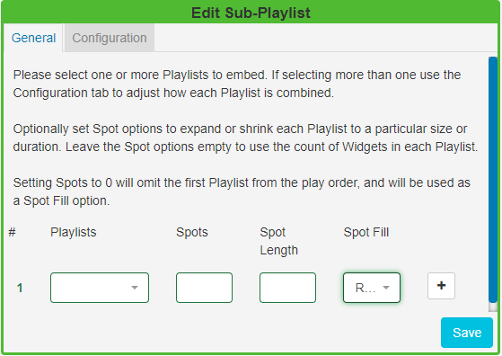
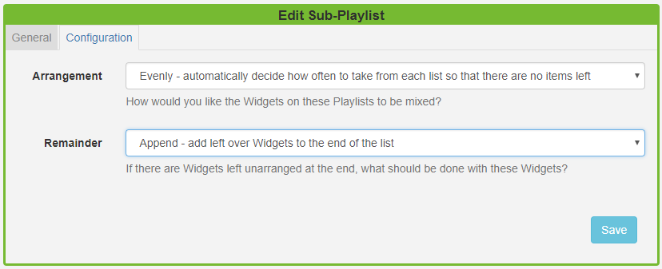
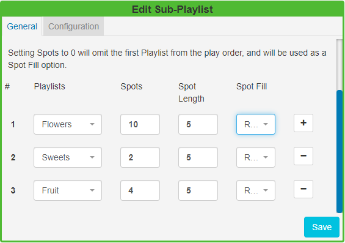

<!--toc=widgets-->

# Sub-Playlists (New Features for v2)

The Sub-Playlists Widget allows for pre-defined Playlists to be simply added to a Layout.

{tip}
Ensure that you have created a  [Playlist](media_playlists.html) prior to adding this Widget.
{/tip}

Click on the **Sub-Playlist Widget** on the  toolbar, add / drag to the target **Region**. 

### General

Use the drop-down menu to select a **Playlist** to embed.

Included on this tab are optional **Spot** options which allow for the defining of advertising/promotional spots.

**Spots**

- Specify the **total number** of Spots you would like to be available for that Playlist to expand or shrink to a specified size.
- Leave this field **blank** to use the count of Widgets assigned to the Playlist to maintain the size.
- Set to **0** to omit the **first Playlist** from the play order. This Playlist can be used as a spot filler from the Spot Fill options. **Please note:** If you wish to provide a Playlist to be used as a 'Spot Fill' you must ensure that it is the first Playlist selected.

**Spot Length**

- Set the length in seconds that you would like to apply to all Widgets assigned to that Playlist. 
- Leave this field blank to use the Widget duration.

**Spot Fill** 
Determine how remaining Spots should be filled in the event that there are not enough Widgets on the Playlist to fill the specified number of Spots.

- **Repeat** - Widgets are repeated in the Playlist until the number of Spots has been fulfilled.
- **Fill** - Widgets are taken from the first Playlist to fill any remaining Spots.
- **Pad** - Widgets are taken from the first Playlist and distributed evenly with the assigned Widgets on that Playlist.

 Use the + button to add multiple Playlists and complete the optional Spot options.

If you select more than one Playlist, click on the **Configuration** tab to further define a play order.

### Configuration

The Configuration tab contains the following options:

**Playlist Ordering**

**Play all** - Playlists will play in their entirety one after the other in the order they appear on the General tab.

**Round Robin** - Takes one Widget from each Playlist in the order they appear on the General tab and repeats.

**Auto** - Ensures that Widgets are played evenly from each Playlist. Auto uses the total count of Widgets in each list and divides by the smallest list. This determines how often it should take media items from each list to ensure an even play from each Playlist.

{tip}
**Scenario**:

I have three Playlists with images of Flowers, Sweets and Fruit which vary in Spot allocation.  I would like an even spread of media items from each of these Playlists to be played:

Set with an **Auto** configuration media would be taken from each Playlist as follows:

5 x Flowers, 1 x Sweet, 2 x Fruit and will then repeat until the specified Slots have been fulfilled, which would be one more rotation in this scenario.
{/tip}

There are also options to decide what should be done with any Widgets that are left unordered at the end of a Playlist:

**Remaining Widgets**

**Add** - includes any remaining Widgets which are then added to the end of the Playlist.

**Discard** - will use the Playlist with the least Widgets and ignore any remaining Widgets on the longer Playlists. 

**Repeat** - will use the Playlist with the most Widgets and repeat any remaining Widgets on the shorter Playlists.

{tip}
The Sub-Playlist preview shows the number of Widgets and total duration after play order and Spot options are taken into consideration. Use the Layout preview to see each Widget in the list previewed in sequence.
{/tip}

