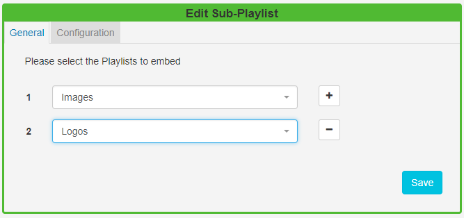

<!--toc=widgets-->

# Sub-Playlists (New Feature for 2.0)

The Sub-Playlists Widget allows for pre-defined Playlists to be simply added to a Region.

{tip}
Ensure that you have created a  [Playlist](media_playlists.html) prior to adding this Widget.
{/tip}

Click on the **Sub-Playlist Widget** on the  toolbar, add / drag to the target **Region**. 

### General

Use the drop-down menu to select the **Playlist** to embed. Use the + button to add more than one Playlist to a Region. 

If you choose more than one Playlist, click on the **Configuration** tab to define how your selected Playlists should playout.

### Configuration

The Configuration Tab contains **Arrangement** options as to how you would like the Widgets to playout on the Playlists:

**Sequentially** - Playlists will play in their entirety one after the other

**Round Robin** -  will take one media item from each list and then repeat

**Evenly** -  will calculate how often to take a media item from each list to ensure that there are no items left on a Playlist.

There are also **Remainder** options to decide what should be done with **Widgets** that are left 'unarranged' at the end of a Playlist:

**Append** - will add remaining Widgets to the end of the Playlist

**Drop** - uses the Playlist with the shortest total length and ignores the remainder on the other Playlists

**Repeat** - uses the Playlist with the longest total length and repeats the remainder on the other Playlists.

{tip}
A Preview is not available for Sub-Playlists. However, the total number of Widgets included in the Playlist and the total duration is shown.
{/tip}

