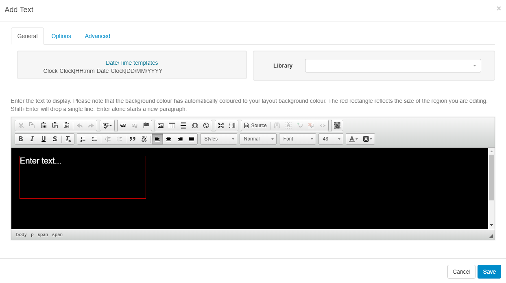
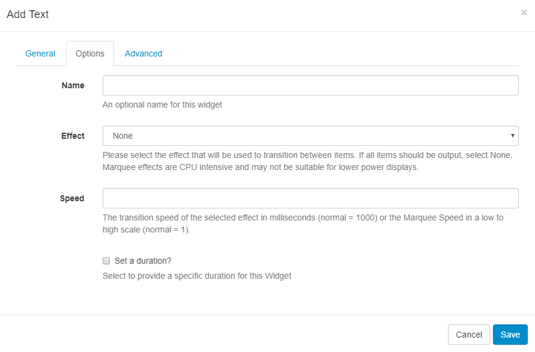

<!--toc=widgets-->

# Text

Add Text directly onto a Layout using the Text Widget which provides a rich text editor for formatting options to apply an Effect to your text.

The text editor will open with the same background as selected for the Layout and will use a complimentary text colour for the chosen background colour.

The thin red border in the text editing window represents the **Region** size. Ensure that formatted text remains within this border.

Optionally use the Date/Time templates by double-clicking on the field tag you wish to use. This will then appear in the text editor ready to be formatted.

{tip}

**Additional Fonts** can be added to this editor by uploading files to the **Library**. Please be aware that Fonts have 'preferences' built into them known as OS/2 Tags. [[PRODUCTNAME]] checks these OS/2 preferences, and can use Fonts with OS/2 tags 0 or 8. Fonts with other tags may not display correctly or you may receive an error on upload.

{/tip}

## Options

**Name** - give an optional name for this Widget.

**Effect** - use the drop down to select an effect to be applied to your text.

**Speed** -  select a speed for the selected effect.

**Set a duration** - override the default duration.

{tip}

It is typical to have a text item as the only Media item assigned to a Region Playlist, therefore the duration can be set to a low value.

{/tip}

### CKEditor

CKEditor is used for Text input. Complete documentation for all the buttons can be found on the [CKEditor's website](http://docs.cksource.com/CKEditor_3.x/Users_Guide).

{tip}

Text formatting is HTML, **view source** on the text editor to adjust the HTML manually if you prefer.

{/tip}: