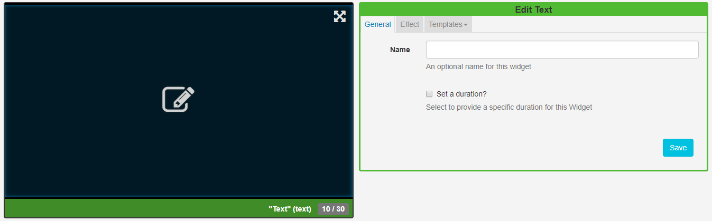
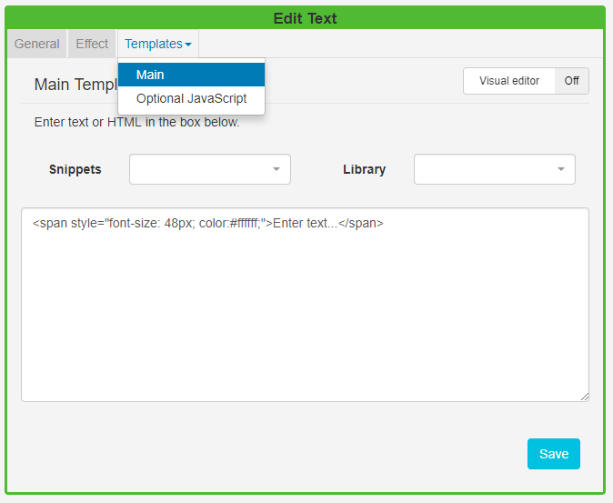

<!--toc=widgets-->

# Text

Add Text directly onto a Layout by using the Text Widget. 

Click on the **Text Widget** on the toolbar, add / drag to the target **Region**. 

{tip}
If you are using 1.8, select **Text** from the Widget Toolbox to add to your Region Timeline.
{/tip}

### Text Editor

Click in the Preview window to open the inline editor to enter text and apply formatting.

The text editor will open with the same background as selected for the Layout and will use a complimentary text colour for the chosen background colour.

The thin red border in the text editing window represents the **Region** size. Ensure that formatted text remains within this border.

Optionally use date/time merge tags, available from the **Snippets** menu. 

### General

- Provide an optional name.

- Choose to override the default duration.

  {tip}

  It is typical to have a text item as the only media item assigned to a Region, therefore the duration can be set to a low value.

  {/tip}

### Effect

- Use the drop-down menu to select an effect to be applied to your text.
- Select a speed for the selected effect.
- Optionally add a background colour.
- Include a selector to use for marquee items.

### Templates

Click on the Template header to enter HTML directly into the box provided.

{tip}

**Additional Fonts** can be added to this editor by uploading files to the **Library**. Please be aware that fonts have 'preferences' built into them known as OS/2 tags. [[PRODUCTNAME]] checks these OS/2 preferences, and can use fonts with OS/2 tags 0 or 8. Fonts with other tags may not display correctly or you may receive an error on upload.
{/tip}

## Available Formatting

Date / time can be formatted by providing "tokens" that sit between square brackets [] in the template area.

| Title                      | Token   | Output                                 |
| -------------------------- | ------- | -------------------------------------- |
| Month                      | M       | 1 2 ... 11 12                          |
|                            | Mo      | 1st 2nd ... 11th 12th                  |
|                            | MM      | 01 02 ... 11 12                        |
|                            | MMM     | Jan Feb ... Nov Dec                    |
|                            | MMMM    | January February ... November December |
| Quarter                    | Q       | 1 2 3 4                                |
| Day of Month               | D       | 1 2 ... 30 31                          |
|                            | Do      | 1st 2nd ... 30th 31st                  |
|                            | DD      | 01 02 ... 30 31                        |
| Day of Year                | DDD     | 1 2 ... 364 365                        |
|                            | DDDo    | 1st 2nd ... 364th 365th                |
|                            | DDDD    | 001 002 ... 364 365                    |
| Day of Week                | d       | 0 1 ... 5 6                            |
|                            | do      | 0th 1st ... 5th 6th                    |
|                            | dd      | Su Mo ... Fr Sa                        |
|                            | ddd     | Sun Mon ... Fri Sat                    |
|                            | dddd    | Sunday Monday ... Friday Saturday      |
| Day of Week (Locale)       | e       | 0 1 ... 5 6                            |
| Day of Week (ISO)          | E       | 1 2 ... 6 7                            |
| Week of Year               | w       | 1 2 ... 52 53                          |
|                            | wo      | 1st 2nd ... 52nd 53rd                  |
|                            | ww      | 01 02 ... 52 53                        |
| Week of Year (ISO)         | W       | 1 2 ... 52 53                          |
|                            | Wo      | 1st 2nd ... 52nd 53rd                  |
|                            | WW      | 01 02 ... 52 53                        |
| Year                       | YY      | 70 71 ... 29 30                        |
|                            | YYYY    | 1970 1971 ... 2029 2030                |
| Week Year                  | gg      | 70 71 ... 29 30                        |
|                            | gggg    | 1970 1971 ... 2029 2030                |
| Week Year (ISO)            | GG      | 70 71 ... 29 30                        |
|                            | GGGG    | 1970 1971 ... 2029 2030                |
| AM/PM                      | A       | AM PM                                  |
|                            | a       | am pm                                  |
| Hour                       | H       | 0 1 ... 22 23                          |
|                            | HH      | 00 01 ... 22 23                        |
|                            | h       | 1 2 ... 11 12                          |
|                            | hh      | 01 02 ... 11 12                        |
| Minute                     | m       | 0 1 ... 58 59                          |
|                            | mm      | 00 01 ... 58 59                        |
| Second                     | s       | 0 1 ... 58 59                          |
|                            | ss      | 00 01 ... 58 59                        |
| Fractional Second          | S       | 0 1 ... 8 9                            |
|                            | SS      | 0 1 ... 98 99                          |
|                            | SSS     | 0 1 ... 998 999                        |
| Timezone                   | z or zz | EST CST ... MST PST                    |
|                            | Z       | -07:00 -06:00 ... +06:00 +07:00        |
|                            | ZZ      | -0700 -0600 ... +0600 +0700            |
| Unix Timestamp             | X       | 1360013296                             |
| Unix Millisecond Timestamp | x       | 1360013296123                          |

### CKEditor

CKEditor is used for Text input. Complete documentation for all the buttons can be found on the [CKEditor's website](http://docs.cksource.com/CKEditor_3.x/Users_Guide).