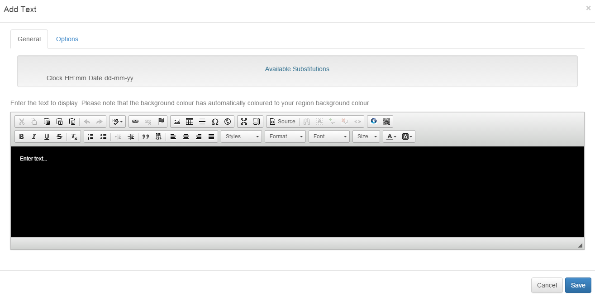
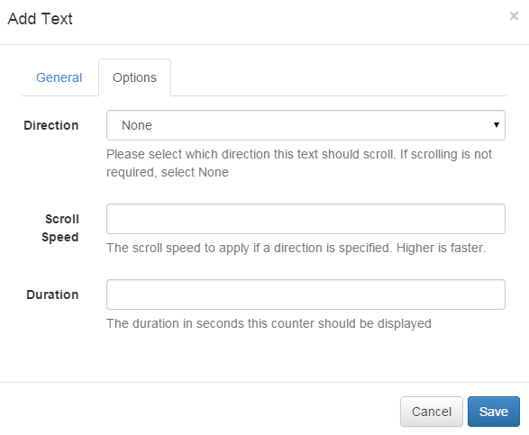

<!--toc=widgets-->
#Text
Text media is entered directly on a Layout in a Region Playlist. A rich editor is provided for formatting the text 
for display.

[Fonts](media_module_font.html) can be added to the editor using the Font module.

The text editor will have a background colour that is identical to the layout background colour and will provide a 
complimentary text colour when first opened. A red box will appear in the text editing window which signifies the size
of the region being edited. Text will wrap within that box, but can exceed the box height.

##Options
Text items can also have a scroll direction, speed and must have a duration of play. It is typical to have a text item 
as the only item in a Region Playlist and therefore the duration can be set to 1 second (or another low value).

##CKEditor
CKEditor is used for text input. Complete documentation for all the buttons is available over 
at [CKEditor's website](http://docs.cksource.com/CKEditor_3.x/Users_Guide).

Text formatting is actually HTML and you can "view source" on the text editor to adjust the HTML manually 
if you choose.
