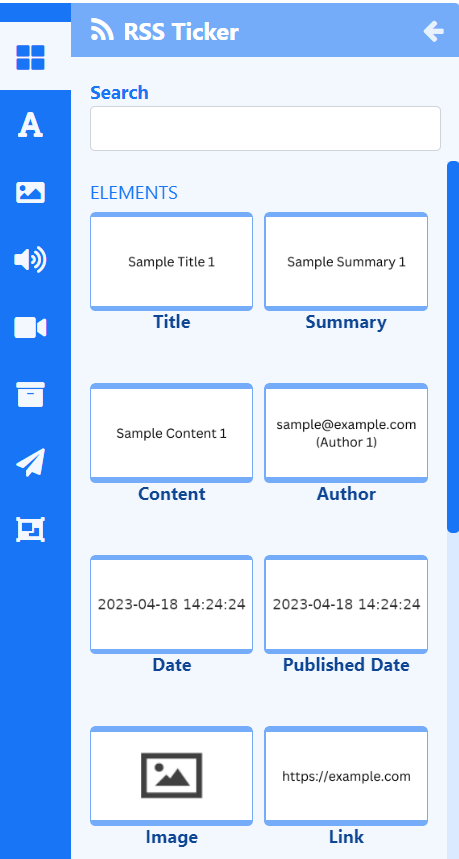

# RSS Ticker

Display dynamic feed content anywhere on a Layout using Elements or include Static Templates with pre-styled designs in Layouts/Playlists.

{feat}Ticker|v4{/feat}

The Ticker Widget primarily consists of a data source location which feeds into configured Elements and Static Templates.

## Ticker Elements

[Elements](layouts_editor#content-data-widgets-and-elements) are available for selection when adding an RSS Ticker Widget to a [Layout](layouts_editor.html) to give Users more control over what components of the Ticker Widget to use and where they can be placed. 

Each Element has a set of configuration options in the Properties Panel. A URL must be provided to be used as the data source from the **Configure** tab for each Element used on the Layout. Control how items should be cycled by specifying a [Data Slot](layouts_editor.html#content-data-slots) to use for each of the added Elements. Data Elements can be further complimented by adding [Global Elements](layouts_editor.html#content-global-elements) to add shapes and text which can all be put into an [Element Group](layouts_editor.html#content-grouping-elements) for easier configuration and positioning.

## DataSet Static Templates

[Static Templates](layouts_editor.html#content-static-templates) define how returned items should be laid out and styled and are a simple way to show items using pre-styled templates.

Templates can be configured to affect the behaviour of returned results as well as make changes to the design appearance using a range of options in the Properties Panel. A URL must be provided to be used as the data source from the **Configure** tab for each Template added to the Layout/Playlist.

## Overview

- Define how many items should show from a feed.
- Duration can be set per item.

{tip}
Use this option with caution as this can create long-running media items. Ensure to use in conjunction with **Number of items** to limit!
{/tip}

- Select to start with items from the Start or End of the list.

- Reverse and Random order of feed items can be selected.

- Include a Copyright notice to show at the end of the feed.

- Return results side by side.

- Provide a list of attributes that should not be stripped from the incoming feed.

- Include a list of HTML tags to be stripped from the feed.

- Set a specific User Agent.

- Decode HTML entities in the feed before parsing it.

- Disable date sort.

- Cached for off-line playback.

- Override the Update Interval for Images.

  

{tip}
Create your own [RSS Feed](media_datasets.html#content-view-rss) to use with this Widget using [DataSets](media_datasets.html)!
{/tip}

