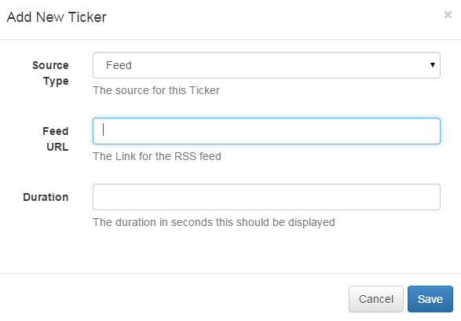
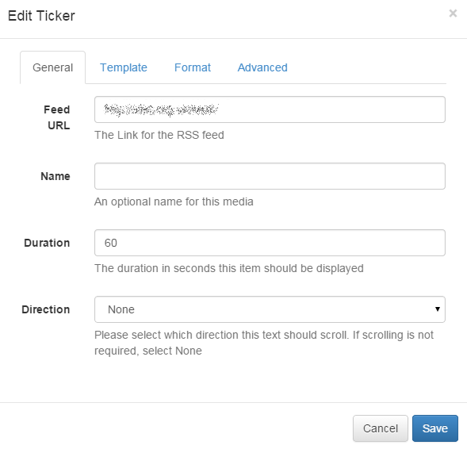
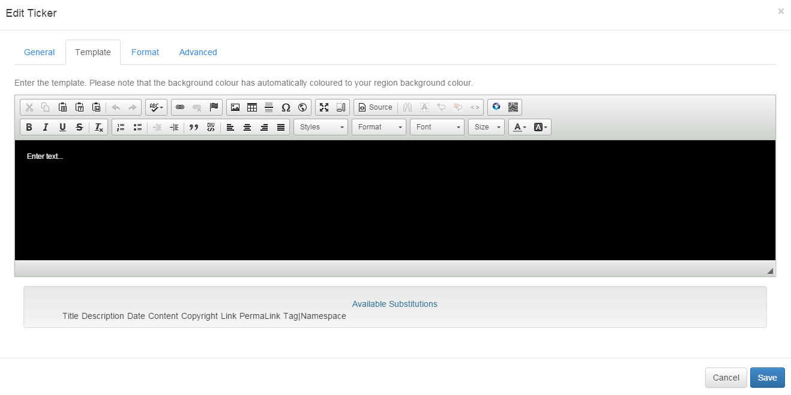

<!--toc=widgets-->
# Ticker

The Ticker module allows dynamic Feed and DataSet content to be added to a Layout. The Ticker module primarily consists of a data source location and a template to apply to each data item retrieved from that data source.

For example, if the data source is a RSS Feed, the feed will have multiple items and the template will be applied to each of these items.

Tickers are specific to a layout rather than saved in the library - this means that text items are not reusable and will need to be copied / pasted between Layouts if the same text is required on more than one.

## Adding a Ticker

When adding a new Ticker the CMS provides a simple form asking for the Data Source and duration of the Ticker. These items cannot be changed without re-creating the Ticker.

- **Source Type**

    Whether the Ticker uses a Feed (RSS / Atom / XML) or a CMS DataSet as its Data Source.

- **Feed URL**

    If using a Feed, the URL of the Feed.

- **DataSet**

    If using a DataSet, the DataSet to use.

- **Duration**

    The Duration this media item should be shown in the Timeline. In seconds.

After choosing the Source of the Ticker the Edit form will automatically open, providing access to the other options.

## Editing

All Tickers have some common settings in the CMS, regardless of the Data Source.

- **Direction**

    Tickers can be scrolling left / right / top and bottom. Tickers can also be static using the "None" direction and can be split into pages that are automatically cycled using the "Single" mode.

- **Duration**

    The duration in seconds that this text item should remain in the Region.

- **Duration is per Item**

    If the Duration is per Item the configured Duration will be extended by the Number of Items that is returned by the Data Source. This should be used carefully as it can create long running media items. Typically it is preferable to use this setting in conjunction with a setting to limit the number of items shown.

- **Scroll Speed**

    Speed up or slow down the scroll rate - assuming you have a Direction selected.

- **Fix text to region?**

    Should the text resize to fill the entire available space in the Region? This option should only be used for a single line text item. The default behaviour is to scale the text to fill the Display Client resolution.

- **Update Interval**

    [[PRODUCTNAME]] Display Clients can cache the content of this media type to prevent repeated download of identical resources. They are also cached for off-line playback.

- **Items per Page**

    When using "Single" mode, how many items should appear on each page.

- **Show side by Side**

    When there is more than 1 item per page, should the items be shown side-by-side.

- **Style Sheet**

    An optional style sheet to apply to the entire Ticker.

The Ticker Edit form has minor differences depending on the Data Source of the Ticker that is being edited.

### Feed

- **from the**

    Where should items be taken from? Used in conjunction with the "Number of Items" setting.

- **Copyright**

    Should the Display Client insert a Copyright notice at the end of the feed.
    
- **Randomise**

    Should the feed items be shown in a random order? Random feeds work offline; the entire feed is parsed, rendered 
    and downloaded to the Player and then sorted in a random fashion for display. We use a Durstenfeld shuffle to
    randomise the order of items. Randomise works on the full feed, "number of items" and "take items from".

- **Substitutions**

    The available keywords to use in the template that will be substituted with content from the feed. The CMS supports 
    a set of default keywords that will be present of the majority of feeds. A special notation is also available where 
    the user can specify the Tag|Namespace within the feed for [[PRODUCTNAME]] to extract content.

The Available Substitutions can be double clicked to automatically insert them into the Template editing area.

### Data Set

- **Order**

    An Order by clause using SQL syntax that should be applied to the Data Source. e.g. Name DESC

- **Filter**

    A filtering clause using SQL syntax that should be applied to the Data Source. e.g. Region = 'Europe'

- **Upper Row Limit**

    The upper row count (0 = unlimited)

- **Lower Row Limit**

    The lower row count (0 = unlimited)

- **Substitutions**

    The available columns to use in the template that will be substituted with content from the DataSet Columns. The CMS will look up the columns for the DataSet and present a set to substitutions. These should be double clicked to add into the template.

## Optional Style sheet

The Optional Style sheet is applied to the entire Ticker media item when shown on the Display Clients. This is intended for advanced use to "tweak" the CMS generated output.
