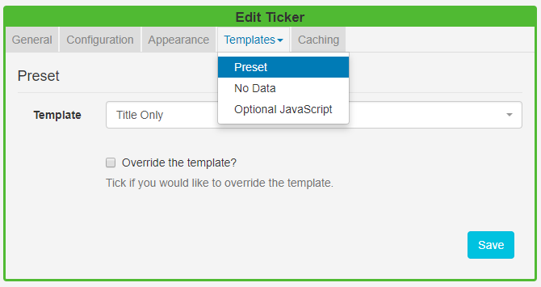
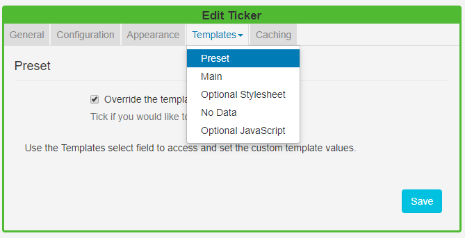

<!--toc=widgets-->
# Ticker

The Ticker Widget allows **dynamic Feed** content to be added to a Layout. The Ticker module primarily consists of a data source location and a template to apply to the retrieved data.

Click on the **Ticker Widget** on the  toolbar, add / drag to the target **Region**. 

{tip}
If you are using 1.8 please use the following link to the appropriate manual page for this version: [Ticker 1.8](media_module_ticker_1.8.html)
{/tip}

### General

- Provide an optional name
- Choose to override the default duration
- Opt to extend the duration by the number of items.

{tip}
Use with caution as this can create long-running media items. Use in conjunction with ‘Number of items’ to limit this.
{/tip}

### Configuration

- Specify the Feed URL.

- Choose how many RSS items should be returned.
- Select to start with items from the beginning or end of the list.
- Random feeds work offline; the entire feed is parsed, rendered and downloaded to the Player and then sorted in a random fashion for display. We use a Durstenfeld shuffle to randomise the order of items. Randomise works on the full feed, "Number of items" and "Take items from" options.
- Display a Copyright notice at the end of the feed.
- Opt to display returned results side by side.
- Apply a Date Format to apply to all returned date results. 
- Include a comma-separated list of attributes that will not be stripped from the incoming feed.
- Include a comma-separated list of HTML tags to be stripped from the feed.
- Select to disable the date sort for the feed.

### Appearance

- Optionally select a background colour
- Use the drop-down menu to select an **Effect** to be used to transition between items.
- Set the **Speed** for the selected effect.
- Select the **direction** of the text in the feed to use, right to left or left to right.
- Enter how many Items should appear on each page, if an effect to split items has been selected.

### Templates

Select **Preset Templates** or provide your own using JavaScript.

#### Preset

- Use the drop-down to select an appropriate template.
- Choose to **Override** the selected template.

{tip}
By selecting to **Override the Template** you can enter your own text, html and CSS by using the templates  available from clicking on the Templates tab.
{/tip}

{tip}
Toggle on the **Visual editor** to use the inline editor.
{/tip}

{tip}
A special notation is available where the User can specify the Tag|Namespace within the feed for [[PRODUCTNAME]] to extract content.
{/tip}

#### Optional Style Sheet

This is applied to the entire Ticker media item when shown on Displays.

{tip}
This is intended for advanced users to ‘tweak’ the CMS generated output.
{/tip}

#### No Data

Use the **No Data** template to include a message to display when there is no data returned from the source.

### Caching

Players can **cache** the content of this media type to prevent repeated downloads and off-line playback. Keep this number as high as possible.

